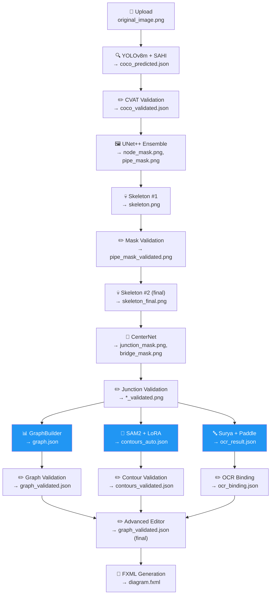

# ARCHITECTURE.md — Архитектура P&ID Pipeline

**Аудитория:** ALL
**Версия:** 1.1
**Обновлено:** 2026-04-09
**Связанные документы:** [GLOSSARY.md](GLOSSARY.md), [STATUS_MACHINE.md](STATUS_MACHINE.md), [DB_SCHEMA.md](DB_SCHEMA.md), [DATA_FORMATS.md](DATA_FORMATS.md)

---

## Содержание

1. [Назначение проекта](#1-назначение-проекта)
2. [Обзор pipeline](#2-обзор-pipeline)
3. [Data Flow](#3-data-flow)
4. [Docker-сервисы](#4-docker-сервисы)
5. [Storage layout](#5-storage-layout)
6. [Артефакты pipeline](#6-артефакты-pipeline)
7. [Параллелизм](#7-параллелизм)
8. [UI: Desktop-приложение](#8-ui-desktop-приложение)
9. [Технологический стек](#9-технологический-стек)

---

## 1. Назначение проекта

P&ID Pipeline — система автоматической оцифровки технологических схем трубопроводов и КИПиА (P&ID — Piping and Instrumentation Diagram) атомных и тепловых электростанций.

Входные данные — сканированные растровые изображения P&ID схем. Выходные данные — структурированный FXML-файл, содержащий граф оборудования (узлы), трубопроводов (рёбра), контуры элементов (полигоны) и привязанную текстовую информацию (KKS-коды, диаметры, подписи). FXML используется в САПР для дальнейшей работы с оцифрованной схемой.

Pipeline включает 6 ML-моделей (UNet++ ensemble из двух checkpoint'ов), 12 этапов обработки с промежуточной валидацией оператором, интеграцию с CVAT для аннотирования и desktop-приложение на PySide6 для управления процессом.

---

## 2. Обзор pipeline

Pipeline состоит из 12 этапов (в UI отображаются как «бусины» — цветные индикаторы прогресса). Этапы делятся на автоматические (GPU worker) и ручные (валидация оператором в UI).

| # | Бусина | Тип | Модель / Действие | Описание |
|---|--------|-----|-------------------|----------|
| 0 | Детекция | auto/GPU | YOLOv8m + SAHI | Детекция узлов оборудования на схеме |
| 1 | Вал. дет. | manual | CVAT (браузер) | Валидация bounding box в CVAT |
| 2 | Сегмент. | auto/GPU | UNet++ ensemble | Сегментация труб и узлов → маски + начальный скелет |
| 3 | Вал. pipe | manual | UI: PipeTab | Валидация и коррекция масок сегментации |
| 4 | Вал. j/b | auto+manual | CenterNet + UI: JunctionTab | Детекция перекрёстков/мостов (авто) + валидация (ручная) |
| 5 | Граф | auto/CPU | GraphBuilder | Построение графа из скелета, масок и перекрёстков |
| 6 | Вал. графа | manual | UI: SimpleGraphTab | Базовая валидация графа (удаление/добавление узлов и рёбер) |
| 7 | Контуры | auto/GPU | SAM2 + LoRA | Извлечение контуров оборудования (полигоны) |
| 8 | OCR | auto/GPU | Surya + PaddleOCR | Распознавание текста на схеме |
| 9 | Привязка | manual | UI: OcrBindingTab | Привязка OCR-текста к узлам (KKS) и рёбрам (диаметры) |
| 10 | Редактор | manual | UI: AdvancedGraphTab | Финальное редактирование графа + привязок |
| 11 | FXML | auto/CPU | graph_to_fxml | Генерация выходного FXML-файла |

Между ручными этапами pipeline автоматически запускает следующий автоматический этап (auto-dispatch chain). Подробнее о переходах статусов — см. [STATUS_MACHINE.md](STATUS_MACHINE.md).

---

## 3. Data Flow



Три ветки после валидации перекрёстков (Graph, SAM2, OCR) запускаются **параллельно** — подробнее в [§7](#7-параллелизм).

---

## 4. Docker-сервисы

Приложение разворачивается через `docker-compose.yml` и включает две группы сервисов: P&ID Pipeline и CVAT.

### P&ID Pipeline

| Сервис | Контейнер | Образ / Dockerfile | Порт | GPU | Описание |
|--------|-----------|-------------------|------|-----|----------|
| `postgres` | `pid_postgres` | `postgres:15-alpine` | 5433→5432 | — | БД pipeline (diagrams, artifacts, stages) |
| `redis` | `pid_redis` | `redis:7-alpine` | 6380→6379 | — | Celery broker + result backend |
| `api` | `pid_api` | `Dockerfile.api` | 8000→8000 | — | FastAPI REST API |
| `worker` | `pid_worker` | `Dockerfile.worker` | — | ✅ 1×GPU | Celery worker: detection (YOLO+SAHI), segmentation (UNet++), скелетизация, junction/bridge detection (CenterNet), SAM2 контуры (очереди `gpu`, `default`, `sam2`) |
| `worker_ocr` | `pid_worker_ocr` | `Dockerfile.worker_ocr` | — | ✅ 1×GPU | Celery worker: OCR (очередь `ocr`) |

### CVAT (Computer Vision Annotation Tool)

| Сервис | Контейнер | Образ | Порт | Описание |
|--------|-----------|-------|------|----------|
| `cvat_server` | `cvat_server` | `cvat/server:v2.25.0` | — | Backend CVAT |
| `cvat_ui` | `cvat_ui` | `cvat/ui:v2.25.0` | — | Frontend CVAT |
| `cvat_db` | `cvat_db` | `postgres:15-alpine` | — | БД CVAT |
| `cvat_redis_inmem` | `cvat_redis_inmem` | `redis:7.2-alpine` | — | In-memory кэш |
| `cvat_redis_ondisk` | `cvat_redis_ondisk` | `apache/kvrocks:latest` | — | On-disk хранилище |
| `cvat_worker_*` | `cvat_worker_{import,export,annotation,chunks}` | `cvat/server:v2.25.0` | — | Фоновые workers CVAT |
| `cvat_opa` | `cvat_opa` | `openpolicyagent/opa:0.63.0` | — | Авторизация CVAT |
| `traefik` | `traefik` | `traefik:v2.11` | 8080→8080 | Reverse proxy для CVAT |

### Сети

| Сеть | Участники |
|------|-----------|
| `pid_network` | postgres, redis, api, worker, worker_ocr |
| `cvat` | Все CVAT-сервисы + api + worker (для доступа к CVAT API и shared volume) |

### Volumes

| Volume | Назначение |
|--------|-----------|
| `postgres_data` | Данные PostgreSQL (P&ID) |
| `redis_data` | Данные Redis (P&ID) |
| `cvat_data` | Данные CVAT (изображения, аннотации). Монтируется в `api` и `worker` как read-only |
| `cvat_db`, `cvat_redis_inmem`, `cvat_redis_ondisk`, `cvat_keys`, `cvat_logs` | Инфраструктура CVAT |

Дополнительно через bind mount монтируются: `./storage` (артефакты pipeline), `./models` (веса моделей), `./configs` (конфигурации проектов).

---

## 5. Storage layout

Все артефакты хранятся на файловой системе в структуре `storage/diagrams/{uid}/`, где `{uid}` — UUID диаграммы. Управление через `app/services/storage.py` (класс `StorageService`).

```
storage/diagrams/{uid}/
├── original/
│   └── image.png              # Исходное изображение P&ID
├── detection/
│   ├── coco_predicted.json    # COCO аннотации (YOLO)
│   ├── coco_validated.json    # COCO аннотации (после CVAT)
│   └── detection_overlay.png  # Визуализация детекции (debug)
├── segmentation/
│   ├── node_mask.png          # Маска узлов оборудования
│   ├── pipe_mask.png          # Маска трубопроводов
│   ├── pipe_mask_validated.png # Маска после валидации оператором
│   ├── pipe_mask_refined.png  # Маска после adaptive dilate
│   └── segmentation_overlay.png # Визуализация (debug)
├── skeleton/
│   ├── skeleton.png           # Начальный скелет
│   ├── skeleton_mask.png      # Маска из скелета (для UI)
│   └── skeleton_final.png     # Финальный скелет (после коррекции масок)
├── junction/
│   ├── junction_mask.png      # Маска перекрёстков (CenterNet)
│   ├── bridge_mask.png        # Маска мостов (CenterNet)
│   ├── junction_mask_validated.png # После валидации оператором
│   └── bridge_mask_validated.png   # После валидации оператором
├── graph/
│   ├── graph.json             # Граф (автоматический)
│   ├── graph_validated.json   # Граф (после валидации)
│   └── graph_overlay.png      # Визуализация графа (debug)
├── contours/
│   ├── contours_auto.json     # SAM2 контуры (автоматические)
│   └── contours_validated.json # Контуры после валидации
├── ocr/
│   ├── ocr_cleaned.png        # Очищенное изображение для OCR
│   ├── ocr_result.json        # Результат распознавания
│   ├── ocr_binding.json       # Привязка текста к узлам/рёбрам
│   └── ocr_validation.json    # Результат ручной валидации OCR
└── fxml/
    └── diagram.fxml           # Финальный выходной файл
```

Класс `StorageService` предоставляет async-методы для работы с файлами: `save_upload()`, `save_file()`, `save_text()`, `read_file()`, `read_text()`, `file_exists()`, `delete_diagram_folder()`. Базовый путь задаётся через переменную окружения `STORAGE_PATH` (по умолчанию `./storage/diagrams`).

---

## 6. Артефакты pipeline

Каждый файл, создаваемый pipeline, регистрируется в БД как запись `Artifact` с типом из enum `ArtifactType` (см. `app/models/artifact.py`).

| ArtifactType | Папка | Файл | Формат | Этап |
|-------------|-------|------|--------|------|
| `ORIGINAL_IMAGE` | `original/` | `image.png` | PNG | Upload |
| `COCO_PREDICTED` | `detection/` | `coco_predicted.json` | JSON (COCO) | Detection |
| `COCO_VALIDATED` | `detection/` | `coco_validated.json` | JSON (COCO) | CVAT validation |
| `YOLO_PREDICTED` | `detection/` | — | JSON | Detection (raw YOLO) |
| `YOLO_VALIDATED` | `detection/` | — | JSON | CVAT validation |
| `NODE_MASK` | `segmentation/` | `node_mask.png` | PNG (binary mask) | Segmentation |
| `PIPE_MASK` | `segmentation/` | `pipe_mask.png` | PNG (binary mask) | Segmentation |
| `PIPE_MASK_VALIDATED` | `segmentation/` | `pipe_mask_validated.png` | PNG (binary mask) | Mask validation |
| `PIPE_MASK_REFINED` | `segmentation/` | `pipe_mask_refined.png` | PNG (binary mask) | OCR preprocessing |
| `SKELETON` | `skeleton/` | `skeleton.png` | PNG (binary) | Skeleton #1 |
| `SKELETON_MASK` | `skeleton/` | `skeleton_mask.png` | PNG (binary) | Skeleton #1 |
| `SKELETON_FINAL` | `skeleton/` | `skeleton_final.png` | PNG (binary) | Skeleton #2 |
| `JUNCTION_MASK` | `junction/` | `junction_mask.png` | PNG (binary mask) | Junction detection |
| `BRIDGE_MASK` | `junction/` | `bridge_mask.png` | PNG (binary mask) | Junction detection |
| `JUNCTION_MASK_VALIDATED` | `junction/` | `junction_mask_validated.png` | PNG (binary mask) | Junction validation |
| `BRIDGE_MASK_VALIDATED` | `junction/` | `bridge_mask_validated.png` | PNG (binary mask) | Junction validation |
| `GRAPH_JSON` | `graph/` | `graph.json` | JSON | Graph build |
| `GRAPH_VALIDATED` | `graph/` | `graph_validated.json` | JSON | Graph validation |
| `CONTOURS_AUTO` | `contours/` | `contours_auto.json` | JSON | SAM2 extraction |
| `CONTOURS_VALIDATED` | `contours/` | `contours_validated.json` | JSON | Contour validation |
| `OCR_CLEANED` | `ocr/` | `ocr_cleaned.png` | PNG | OCR |
| `OCR_RESULT` | `ocr/` | `ocr_result.json` | JSON | OCR |
| `OCR_BINDING` | `ocr/` | `ocr_binding.json` | JSON | OCR binding |
| `OCR_VALIDATION` | `ocr/` | `ocr_validation.json` | JSON | OCR validation |
| `FXML` | `fxml/` | `diagram.fxml` | FXML (XML) | FXML generation |
| `DETECTION_OVERLAY` | `detection/` | `detection_overlay.png` | PNG | Debug |
| `SEGMENTATION_OVERLAY` | `segmentation/` | `segmentation_overlay.png` | PNG | Debug |
| `GRAPH_OVERLAY` | `graph/` | `graph_overlay.png` | PNG | Debug |

Подробное описание JSON-форматов — см. [DATA_FORMATS.md](DATA_FORMATS.md).

---

## 7. Параллелизм

После завершения валидации перекрёстков (`VALIDATED_JUNCTIONS`) endpoint `complete_junction_validation` запускает **три задачи параллельно** (см. `app/api/validation.py`):

```
VALIDATED_JUNCTIONS
    ├── task_build_graph       → queue: gpu       → BUILDING_GRAPH → BUILT
    ├── task_extract_contours  → queue: sam2       → EXTRACTING_CONTOURS → CONTOURS_EXTRACTED
    └── task_run_ocr           → queue: ocr        → OCR_PROCESSING → OCR_COMPLETED
```

Каждая задача выполняется в своём Celery worker (или очереди) и не зависит от результатов остальных. Статус `DiagramStatus` в БД отражает **основную ветку** (graph), а OCR и SAM2 отслеживаются по наличию артефактов.

### OCR Polling

Поскольку `DiagramStatus` не может одновременно быть в двух состояниях, UI использует отдельный механизм отслеживания OCR:

1. При параллельных статусах (от `BUILDING_GRAPH` до `CONTOURS_VALIDATED`) UI проверяет наличие артефакта `ocr_result.json` через endpoint `GET /api/ocr/{uid}/status`.
2. Если OCR ещё не завершён — запускается таймер `_ocr_poll_timer` (каждые 3 секунды). Основной `StatusProvider` опрашивает API каждые 2 секунды (`poll_interval_ms=2000`).
3. Когда артефакт появляется — бусина OCR переключается в `COMPLETED`, бусина «Привязка» становится `AVAILABLE`.

### Слияние контуров в граф

При генерации FXML (`task_generate_fxml`) SAM2-контуры автоматически вливаются в граф: для каждого узла графа ищется контур с максимальным IoU bounding box, и полигон записывается в поле `segmentation` узла.

---

## 8. UI: Desktop-приложение

Пользовательский интерфейс — desktop-приложение на PySide6 (Qt for Python). Запуск: `python -m ui.main`.

### Структура окна

```
┌─────────────────────────────────────────────────┐
│  MainWindow                                     │
│  ├── DiagramList (левая панель / начальный вид)  │
│  │   ├── Выбор проекта                          │
│  │   ├── Upload диаграммы                       │
│  │   └── Список диаграмм (клик → workspace)     │
│  │                                              │
│  └── DiagramWorkspace (рабочая область)          │
│      ├── Header                                 │
│      │   ├── ← Назад | Название диаграммы       │
│      │   ├── ProgressBeads (12 бусин)            │
│      │   └── Action Buttons (12 кнопок)          │
│      │                                          │
│      └── Content (placeholder / вкладка)         │
│          └── [Tab Widget — полноэкранный]        │
└─────────────────────────────────────────────────┘
```

### Бусины прогресса (ProgressBeads)

Виджет `ui/widgets/progress_beads.py` отображает горизонтальную цепочку бусин — по одной на каждый этап pipeline. Состояния бусин:

| Состояние | Цвет | Значение |
|-----------|------|----------|
| `UNAVAILABLE` | Серая | Этап недоступен (предыдущие не завершены) |
| `AVAILABLE` | Белая обводка | Можно начать (все зависимости выполнены) |
| `IN_PROGRESS` | Оранжевая (анимация sweep) | Выполняется фоновая задача |
| `COMPLETED` | Зелёная (галочка ✓) | Этап завершён |
| `ERROR` | Красная | Ошибка выполнения |

Бусины выровнены по X-позициям кнопок действий через `set_anchor_widgets()`.

### Кнопки действий

Под каждой бусиной — кнопка с аналогичным состоянием. Цвета кнопок: серая (недоступна), жёлтая (доступна), синяя (в процессе), зелёная (завершена), красная (ошибка, retry).

Клик по **зелёной** кнопке предлагает откат (rollback) до предыдущего этапа с удалением последующих артефактов.

### Вкладки-редакторы

При клике по доступной кнопке открывается полноэкранная вкладка. Header скрывается, вместо него — toolbar вкладки с кнопкой «← Назад». Основные вкладки:

| Вкладка | Класс | Назначение |
|---------|-------|-----------|
| CVAT | `CvatTab` | Встроенный WebView с CVAT для аннотирования bbox |
| Вал. pipe | `PipeTab` | Редактор масок сегментации (polyline/square mask editor) |
| Вал. j/b | `JunctionTab` | Редактор масок перекрёстков и мостов |
| Вал. графа | `SimpleGraphTab` | Базовый редактор графа (удаление/добавление узлов/рёбер) |
| Контуры | `ContourTab` | Редактор SAM2-контуров (полигоны оборудования) |
| Привязка | `OcrBindingTab` | Привязка OCR-текста к узлам и рёбрам |
| Редактор | `AdvancedGraphTab` | Продвинутый редактор: L-routing, KKS binding, autofix |

### Status Polling

`StatusProvider` (`ui/services/status_provider.py`) периодически опрашивает API (`GET /api/diagrams/{uid}`) и эмитит сигнал `status_updated`. `DiagramWorkspace` подписывается на этот сигнал и обновляет бусины и кнопки. Polling приостанавливается, пока открыта вкладка (для экономии ресурсов и предотвращения мерцания WebEngine).

### Autosave

`AutoSaveService` (`ui/services/autosave.py`) автоматически сохраняет изменения открытой вкладки по таймеру, вызывая соответствующий метод сохранения.

---

## 9. Технологический стек

| Компонент | Технология | Версия |
|-----------|-----------|--------|
| Язык | Python | 3.11 |
| API | FastAPI + Uvicorn | — |
| ORM | SQLAlchemy (async) | 2.x |
| БД | PostgreSQL | 15 |
| Миграции | Alembic | — |
| Очередь задач | Celery | — |
| Брокер | Redis | 7 |
| Desktop UI | PySide6 (Qt 6) | — |
| Detection | YOLOv8m (Ultralytics) + SAHI | — |
| Segmentation | UNet++ (segmentation_models_pytorch) | — |
| Junction | CenterNet (custom) | — |
| Contours | SAM2 Hiera Small + LoRA | — |
| OCR | Surya + PaddleOCR | — |
| Аннотирование | CVAT | v2.25.0 |
| Контейнеризация | Docker + Docker Compose | — |
| GPU | NVIDIA CUDA + nvidia-container-toolkit | — |
| Конфигурация | Pydantic Settings + YAML | — |
| Reverse Proxy | Traefik | v2.11 |

---

## Новые термины для GLOSSARY.md

| Термин | Описание |
|--------|----------|
| **auto-dispatch chain** | Автоматический запуск следующей Celery task после успешного завершения текущей |
| **StatusProvider** | Сервис UI, периодически опрашивающий API для обновления статуса диаграммы |
| **AutoSaveService** | Сервис UI для автоматического сохранения изменений во вкладках по таймеру |
| **DiagramWorkspace** | Виджет UI — рабочее пространство диаграммы (бусины + кнопки + вкладки) |
| **GraphBuilder** | Модуль построения графа P&ID из скелета, масок и перекрёстков (`modules/graph/core/builder.py`) |

---

## Реестр документации (обновление)

| # | Документ | Статус | Версия | Чат |
|---|---------|--------|--------|-----|
| 1 | `DOCUMENTATION_RULES.md` | ✅ Done | 1.0 | 1 |
| 2 | `GLOSSARY.md` | 🔄 Обновить | — | — |
| 3 | `ARCHITECTURE.md` | ✅ Done | 1.0 | 2 |
