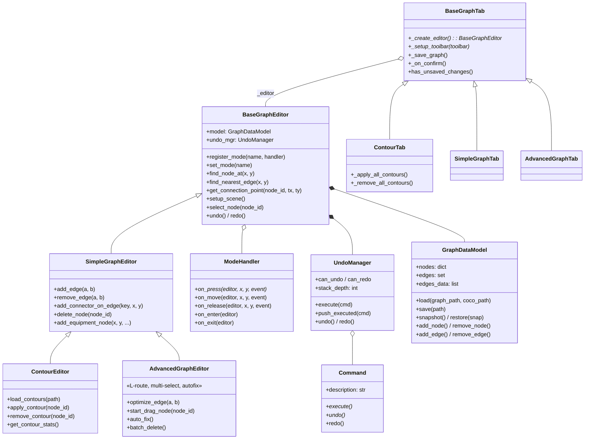

# CODING_GUIDE.md — Паттерны и правила кода P&ID Pipeline

**Аудитория:** DEV
**Версия:** 1.2
**Обновлено:** 2026-08-03
**Связанные документы:** ARCHITECTURE.md, DATA_FORMATS.md, API.md, GLOSSARY.md

---

## Оглавление

1. [Иерархия классов](#1-иерархия-классов)
2. [GraphDataModel — модель данных](#2-graphdatamodel--модель-данных)
3. [Паттерн Command (undo/redo)](#3-паттерн-command-undoredo)
4. [Паттерн ModeHandler](#4-паттерн-modehandler)
5. [Паттерн Overlay](#5-паттерн-overlay)
6. [Координатные соглашения](#6-координатные-соглашения)
7. [Именование](#7-именование)
8. [Чеклисты](#8-чеклисты)

---

## 1. Иерархия классов

### 1.1 Редакторы

Все редакторы графа наследуют от `BaseGraphEditor` (QGraphicsView). Принцип: базовый класс **не обращается** к атрибутам потомков. Расширяемость — через виртуальные методы и хуки.

```
BaseGraphEditor          — рендеринг, zoom, hit testing, selection, event delegation, mode system
  ├── SimpleGraphEditor   — CRUD (add/remove edge, connector, node), resize overlay
  │     ├── ContourEditor       — SAM2 contour apply/remove, confidence coloring
  │     └── AdvancedGraphEditor — L-route рёбра, waypoint drag, multi-select, grid, autofix
```

**BaseGraphEditor** (`ui/editors/base_graph_editor.py`, ~1240 строк) содержит:

- `GraphDataModel` и `UndoManager` как атрибуты `self.model` / `self.undo_mgr`
- Proxy-свойства: `nodes`, `edges`, `edges_data`, `graph_data`, `coco_annotations` — прокидывают к `self.model`
- Рендеринг: `setup_scene()` → Z=0 (darkened image), Z=1 (edges), Z=2-3 (nodes)
- Hit testing: `find_node_at()`, `find_nearest_edge()`, `find_nearest_edge_segment()`
- Connection geometry: `get_connection_point()` — polygon-aware (H/V ray + fallback nearest boundary)
- Selection UI: `select_node()`, `clear_selection()`, `update_hover()`, `update_preview_line()`
- Mode system: `register_mode()`, `set_mode()` → делегация `on_press/move/release` текущему handler
- Events: Ctrl+ЛКМ (click/drag), Ctrl+ПКМ (delete), Shift+ЛКМ (multi-select), wheel (zoom), Ctrl+Z/Ctrl+Shift+Z (undo/redo)

Виртуальные методы (хуки для потомков): `_get_edge_color()`, `_get_edge_pen()`, `_get_equipment_brush()`, `_before_draw_all_edges()`, `_before_edge_draw()`, `_after_statistics_update()`, `_reset_scene_state()`, `_ctrl_right_click_delete()`, `_on_ctrl_lmb_click()`, `_start_ctrl_drag()`, `_update_ctrl_drag()`, `_end_ctrl_drag()`, `_on_shift_lmb_press()`, `_on_shift_lmb_move()`, `_on_shift_lmb_release()` (3 последних — для Shift+ЛКМ multi-select rubber band в AdvancedGraphEditor).

**SimpleGraphEditor** (`ui/editors/simple_graph_editor.py`, ~376 строк) добавляет:

- CRUD: `add_edge()` (point-to-point), `remove_edge()`, `add_connector_on_edge()`, `add_connector_isolated()`, `delete_node()`, `add_equipment_node()`
- Resize: `_enter_resize_mode()` → `ResizableNodeOverlay` → `_on_node_resized()` → `_commit_resize()` → `ResizeNodeCommand`
- Регистрирует 7 режимов: idle, add_edge, delete_edge, add_connector, delete_node, add_node_from_list, resize_node

**ContourEditor** (`ui/editors/contour_editor.py`, ~358 строк) добавляет:

- Загрузка контуров: `load_contours()` (contours_auto.json), `load_applied_state()` (contours_validated.json)
- Toggle: `apply_contour()` / `remove_contour()` — обновляет segmentation, пересчитывает centroid (Shoelace formula), bbox, рёбра
- Визуализация: переопределяет `_get_equipment_brush()` — 4 цвета по статусу контура (applied/review/available/none)
- Регистрирует режим: apply_contour

**AdvancedGraphEditor** (`ui/editors/advanced_graph_editor.py`, ~1940 строк) — полный редактор для production-валидации. Добавляет:

- **Создание рёбер:** переопределяет `add_edge()` — концы садит КАНОН посадки `modules/graph/core/seating.reseat_edge` (Э1: коннектор → центроид, FIXED_SIZES-скин → граница content-rect, полигон → луч в контур, bbox → грань; тот же модуль, что сажает выход раскладки). Старые `connect_bbox_bbox`/… из `graph_geometry.py` в этом классе больше не используются — их единственный живой вызывающий `contour_editor.py` (растровые координаты, канон холста там неприменим)
- **Edge building with waypoints:** `add_edge_with_waypoints()` — ручная прокладка ломаной (Ctrl+Click промежуточных точек)
- **Optimize:** `optimize_edge()` — концы и ось от канона `seating` (Э1); `optimize_all_edges()` — batch; конец с пином входа (`pin_source`/`pin_target`, API — `modules/graph/core/ports.py`) садится в пин первее всего; флаг `_manual_route` мёртв (до 2026-08-03, мигрируется в пины при открытии)
- **Perpendicularity:** `edge_perp_scores` dict, `_before_edge_draw()` вычисляет score; неперпендикулярные рёбра — оранжевые, утолщённые
- **Drag:** `start_drag_node()` / `drag_node_to()` / `end_drag_node()` — одиночный и batch (multi-select); `_batch_move_fast()` для группового drag без routing; `_recalculate_edge()` — посадка концов каноном `seating` (Э1) + маршрут `route_edge_v2`
- **Multi-select:** `selected_nodes` + `selected_edges` sets; `toggle_select_node/edge()`; rubber band (Shift+ЛКМ); `batch_delete()` — snapshot-based undo
- **Waypoints:** показ/скрытие маркеров; `find_waypoint_at()`, drag/add/delete waypoint; waypoints — кэш последнего расчёта маршрута (любой жест вправе перестроить); endpoint markers — протяжка конца ставит/двигает пин входа (`set_edge_pin`), ПКМ по маркеру конца — «отвязать вход» (`clear_edge_pin`); см. UI_GUIDE.md §6.3
- **Grid:** `toggle_grid()`, `snap_to_grid()`, `_compute_grid_size()` (по медиане ширины bbox'ов)
- **Auto-fix:** `auto_fix()` → `auto_fix_graph()` — выравнивание узлов по H/V цепочкам, снимок SnapshotCommand
- **KKS:** hover tooltip по bbox; `_open_kks_edit_dialog()` с нормализацией через `KksMatcher`; toggle KKS labels
- **Diameter:** `_open_diameter_edit_dialog()` → `_propagate_all_diameters()` через `TextBinder`

Переопределяет хуки Base: `_get_edge_color()` (цвет по перпендикулярности/диаметру), `_get_equipment_brush()` (KKS bound → зелёный, no KKS → красный), `_get_edge_pen()` (утолщение для bad edges), `_before_draw_all_edges()` / `_before_edge_draw()` (perp scores), `_reset_scene_state()` (очистка Advanced dict'ов), `_after_statistics_update()` (multi-select visuals), `_on_ctrl_lmb_click()` (делегация в handler), `_start_ctrl_drag()` / `_update_ctrl_drag()` / `_end_ctrl_drag()` (node drag), `_ctrl_right_click_delete()` (с batch delete если элемент в выделении).

Регистрирует 4 дополнительных режима: `optimize_edge`, `drag_node`, `multi_select`, `edit_waypoint`. Также переопределяет handler для `add_edge` → `AddEdgeWithWaypointsHandler`.

### 1.2 Вкладки (Tabs)

Вкладки — Qt-виджеты, которые оборачивают редактор: скачивают артефакты, создают toolbar, обеспечивают save/confirm.

```
BaseGraphTab             — download, save, confirm template, undo, stats
  ├── SimpleGraphTab      — toolbar для SimpleGraphEditor
  ├── AdvancedGraphTab    — toolbar для AdvancedGraphEditor
  └── ContourTab          — toolbar для ContourEditor, save контуров
```

**BaseGraphTab** (`ui/tabs/base_graph_tab.py`, ~399 строк) — template method:

- `_create_editor()` (abstract) — потомок возвращает конкретный editor
- `_setup_toolbar()` (abstract) — потомок заполняет toolbar кнопками режимов
- `_download_artifacts()` → фоновый `_GraphArtifactDownloader` (QThread) → `_on_downloaded()` → `_create_editor()` → `load_data()`
- `_save_graph()` → `editor.save_graph()` → `api_client.upload_validated_graph()`
- `_on_confirm()` → save (если unsaved) → emit `confirmed`
- `has_unsaved_changes()` — сравнивает `undo_mgr.stack_depth` с `_saved_stack_depth`
- Mode sync: `_on_mode_changed()` + `_get_mode_button_map()` → QButtonGroup auto-check

**ContourTab** (`ui/tabs/contour_tab.py`, ~297 строк) добавляет:

- `_on_editor_ready()` — скачивает contours_auto.json, восстанавливает applied state
- `_apply_all_contours()` — batch apply с confidence >= 0.85
- `_remove_all_contours()` — batch remove
- `_save_graph()` override — сохраняет и граф, и contours_validated.json

### 1.3 Диаграмма наследования



---

## 2. GraphDataModel — модель данных

**Файл:** `ui/editors/graph_data.py`

GraphDataModel — единственный source of truth для узлов, рёбер и метаданных графа. Без Qt-зависимостей.

### 2.1 Структура

| Атрибут | Тип | Описание |
|---------|-----|----------|
| `graph_data` | `dict` | Сырой JSON-граф (NetworkX node-link формат) |
| `nodes` | `dict[str, dict]` | `node_id → node dict` |
| `edges` | `set[tuple[str, str]]` | Множество отсортированных ключей `(min_id, max_id)` |
| `edges_data` | `list[dict]` | Список edge dict'ов (совпадает с `graph_data['links']`) |
| `coco_annotations` | `dict[int, dict]` | `ann_id → COCO annotation` |
| `manual_node_counter` | `int` | Счётчик для `node_manual_N` ID |
| `manual_edge_counter` | `int` | Счётчик для `edge_manual_N` ID |
| `_edge_data_index` | `dict[tuple, dict]` | O(1) индекс `edge_key → edge_data` |

### 2.2 CRUD-операции

Все мутации — через методы GraphDataModel. Модель синхронизирует `graph_data['nodes']` и `graph_data['links']` внутри CRUD-методов.

**Nodes:**

- `add_node(node)` → добавляет в `self.nodes` и `graph_data['nodes']`, проверяет дубликаты
- `remove_node(node_id)` → удаляет узел **и все связанные рёбра** каскадно; возвращает `(node_backup, edges_backup)` для undo
- `update_node(node_id, updates)` → частичное обновление через `dict.update()`

**Edges:**

- `add_edge(source, target, edge_data)` → добавляет в `edges` + `edges_data` + index; возвращает `edge_key`
- `remove_edge(key)` → удаляет из всех структур; возвращает `edge_data` для undo
- `update_edge(key, updates)` → частичное обновление

**Запросы:**

- `edge_key(a, b)` → `(min(a, b), max(a, b))` — каноническая форма ключа
- `find_edge_data(key)` → O(1) через `_edge_data_index`
- `edge_exists(a, b)` → `bool`
- `get_connected_edges(node_id)` → `list[tuple]`
- `compute_statistics()` → `{'total_nodes', 'total_edges', 'connected', 'isolated'}`

### 2.3 Snapshot / Restore

Используется для `SnapshotCommand` (batch undo) и может использоваться напрямую.

```python
snap = model.snapshot()   # deepcopy (nodes, edges_data, edges, graph_meta)
# ... мутации ...
model.restore(snap)       # полное восстановление + rebuild index + sync graph_data
```

Snapshot — это tuple из 4 элементов. `restore()` поддерживает обратную совместимость с 3-tuple (старые snapshot'ы без `graph_meta`).

### 2.4 Фабрики

Фабрики создают dict'ы, но **не добавляют** в модель — вызывающий код должен сам вызвать `add_node()` / `add_edge()`.

```python
# Connector: centroid [y, x], area=225, type="connector"
node = model.create_connector_node(x=500.0, y=300.0)
# node['id'] == "node_manual_1", node['centroid'] == [300.0, 500.0]

# Equipment: centroid [y, x], bbox centered around (x, y)
node = model.create_equipment_node(x=500.0, y=300.0, width=40, height=40,
                                    class_id=5, class_name="valve")
# node['bbox'] == [480.0, 280.0, 520.0, 340.0]

# Edge: manual ID, пустые waypoints
edge = model.create_edge_data("node_1", "node_2",
                               source_point=[300.0, 500.0],
                               target_point=[400.0, 600.0])
```

### 2.5 Индексы и ключи

`edge_key(a, b)` всегда сортирует: `edge_key("B", "A") == ("A", "B")`. Это гарантирует уникальность ребра независимо от порядка аргументов.

`_edge_data_index` перестраивается через `rebuild_edge_data_index()` — вызывается автоматически в `load()`, `restore()`, `_redraw_all()`.

---

## 3. Паттерн Command (undo/redo)

**Файлы:** `ui/editors/undo_manager.py`, `ui/editors/commands/simple_commands.py`, `ui/editors/commands/contour_commands.py`, `ui/editors/commands/polygon_commands.py`, `ui/editors/commands/advanced_commands.py`

Каждая мутация графа оборачивается в объект Command с методами `execute()` / `undo()` / `redo()`. Это обеспечивает полный undo/redo через весь стек операций.

### 3.1 Command ABC

```python
class Command(ABC):
    @abstractmethod
    def execute(self) -> None: ...   # Выполнить действие (первый вызов)

    @abstractmethod
    def undo(self) -> None: ...      # Отменить действие

    def redo(self) -> None:          # По умолчанию = execute()
        self.execute()

    @property
    def description(self) -> str:    # Для statusbar: "Добавить ребро A—B"
        return self.__class__.__name__
```

Переопределение `redo()` нужно для команд, которые генерируют ID при первом execute (например, `AddConnectorOnEdgeCommand`) — при redo нужно переиспользовать сохранённые ID, а не генерировать новые.

### 3.2 SnapshotCommand — для batch-операций

Для сложных операций (batch drag, autofix), где инкрементальный undo слишком трудоёмок, используется snapshot-based подход:

```python
cmd = SnapshotCommand(model, redraw_callback=editor._redraw_all)
cmd.execute()           # сохраняет _before = model.snapshot()
# ... произвольные мутации ...
cmd.finalize()          # сохраняет _after = model.snapshot()
cmd.description = "Batch autofix"
undo_mgr.push_executed(cmd)
```

`undo()` восстанавливает `_before`, `redo()` восстанавливает `_after` — затем вызывает `redraw_callback()`.

### 3.3 UndoManager

Два паттерна использования:

| Метод | Когда использовать | Пример |
|-------|-------------------|--------|
| `execute(cmd)` | Instant-операции: клик → выполнить + push | `AddEdgeCommand`, `DeleteNodeCommand` |
| `push_executed(cmd)` | Уже выполненные операции: drag, resize, batch | `SnapshotCommand`, `ResizeNodeCommand` |

Внутри — два deque-стека: `undo_stack` и `redo_stack` (maxlen=100). При `execute()` / `push_executed()` redo-стек очищается.

Свойства: `can_undo`, `can_redo`, `stack_depth` (глубина undo-стека — используется для определения unsaved changes в `BaseGraphTab`).

### 3.4 Гранулярные команды

Все команды из `simple_commands.py` — **гранулярные**: хранят данные для undo/redo без полного snapshot.

| Команда | execute | undo |
|---------|---------|------|
| `AddEdgeCommand` | `model.add_edge()` + `create_edge_item()` + update colors | `model.remove_edge()` + `remove_edge_item()` + update colors |
| `RemoveEdgeCommand` | `model.remove_edge()` + `remove_edge_item()` | `model.add_edge()` + `create_edge_item()` (из `_removed_data`) |
| `AddConnectorOnEdgeCommand` | Удаляет старое ребро, создаёт connector + 2 новых ребра, рисует | Удаляет 2 ребра + connector, восстанавливает старое ребро |
| `AddConnectorIsolatedCommand` | `model.add_node()` + `_draw_single_node()` | `model.remove_node()` + `remove_node_items()` |
| `DeleteNodeCommand` | Запоминает соседей → удаляет рёбра визуально → `model.remove_node()` каскадно → обновляет цвета | Восстанавливает node + все рёбра + цвета |
| `AddEquipmentNodeCommand` | `model.add_node()` + `_draw_single_node()` | `model.remove_node()` + `remove_node_items()` |
| `ResizeNodeCommand` | `model.update_node()` (новые bbox/centroid/area) + `_redraw_all()` | `model.update_node()` (старые) + `_redraw_all()` |

Из `contour_commands.py`:

| Команда | execute | undo |
|---------|---------|------|
| `ToggleContourCommand(editor, node_id, apply=True)` | `editor.apply_contour()` | `editor.remove_contour()` |
| `ToggleContourCommand(editor, node_id, apply=False)` | `editor.remove_contour()` | `editor.apply_contour()` |

Из `polygon_commands.py` (polygon vertex editing):

| Команда | execute | undo |
|---------|---------|------|
| `MoveVertexCommand` | Обновляет `seg[idx*2]`, `seg[idx*2+1]` → `update_polygon_in_node()` | Восстанавливает старые координаты → `update_polygon_in_node()` |
| `AddVertexCommand` | `seg.insert(idx*2, x), seg.insert(idx*2+1, y)` → `update_polygon_in_node()` | `seg.pop(idx*2+1), seg.pop(idx*2)` → `update_polygon_in_node()` |
| `DeleteVertexCommand` | `seg.pop(idx*2+1), seg.pop(idx*2)` (min 3 вершин) | `seg.insert(idx*2, x), seg.insert(idx*2+1, y)` |
| `DrawPolygonCommand` | `update_polygon_in_node()` с новым полигоном, `_applied_nodes.add()` | Восстанавливает old seg/centroid/bbox, `remove_node_items()` + `_draw_single_node()` |
| `DeletePolygonCommand` | `segmentation=None`, восстанавливает pre-SAM2 bbox/centroid если доступны | Восстанавливает полигон, `_applied_nodes.add()` |

Все polygon-команды вызывают `editor.update_polygon_in_node()` — единую цепочку: segmentation → centroid → bbox → redraw → recalculate edges.

Из `advanced_commands.py` (AdvancedGraphEditor):

| Команда | Тип | Описание |
|---------|-----|----------|
| `OptimizeEdgeCommand` | Granular | Пересчёт source/target point + очистка waypoints |
| `DragNodeCommand` | Granular | Сохраняет old/new centroid, bbox, segmentation, edge points |
| `BatchDragCommand` | Snapshot | Alias SnapshotCommand для batch drag нескольких узлов |
| `MoveWaypointCommand` | Granular | Перемещение одного waypoint (old/new) |
| `AddWaypointCommand` | Granular | Вставка waypoint на сегмент ребра |
| `DeleteWaypointCommand` | Granular | Удаление waypoint |
| `AutoLRouteCommand` | Granular | Сохраняет old/new waypoints для L-route |
| `AutoFixCommand` | Snapshot | Alias SnapshotCommand для auto-fix (chain alignment) |

### 3.5 Как написать новую команду

**Чеклист:**

1. Создать класс, наследующий `Command` (или `SnapshotCommand` для batch)
2. В `__init__()` — сохранить ссылки на `model`, `editor` и все параметры; инициализировать поля для backup-данных
3. В `execute()` — выполнить мутацию данных (через `model`) + обновить визуалы (через `editor`)
4. В `undo()` — обратная мутация данных + восстановление визуалов; обновить `update_node_color()` для затронутых узлов
5. Переопределить `redo()` если команда генерирует ID при первом execute (чтобы при redo переиспользовать сохранённые ID)
6. Реализовать `description` property для statusbar
7. В editor-методе вызвать `undo_mgr.execute(cmd)` (или `push_executed(cmd)` для drag/batch)
8. После `execute()` — вызвать `editor.update_statistics()`

**Пример — минимальная команда:**

```python
from ui.editors.undo_manager import Command
from ui.editors.graph_data import GraphDataModel

class SetNodeLabelCommand(Command):
    def __init__(self, model: GraphDataModel, editor, node_id: str,
                 old_label: str, new_label: str):
        self._model = model
        self._editor = editor
        self._node_id = node_id
        self._old = old_label
        self._new = new_label

    def execute(self):
        self._model.update_node(self._node_id, {"label": self._new})
        self._editor._redraw_all()  # или точечное обновление

    def undo(self):
        self._model.update_node(self._node_id, {"label": self._old})
        self._editor._redraw_all()

    @property
    def description(self):
        return f"Label: {self._node_id} → {self._new}"
```

---

## 4. Паттерн ModeHandler

**Файлы:** `ui/editors/mode_handlers/base_handler.py`, `ui/editors/mode_handlers/simple_handlers.py`, `ui/editors/mode_handlers/contour_handler.py`, `ui/editors/mode_handlers/polygon_handlers.py`, `ui/editors/mode_handlers/advanced_handlers.py`

ModeHandler отделяет логику обработки событий мыши от самого редактора. Каждый режим (add_edge, delete_edge, resize_node и т.д.) — отдельный handler.

### 4.1 ModeHandler ABC

```python
class ModeHandler(ABC):
    @abstractmethod
    def on_press(self, editor, x, y, event) -> bool: ...  # Ctrl+Click
    def on_move(self, editor, x, y, event) -> bool: ...   # Mouse move (default: False)
    def on_release(self, editor, x, y, event) -> bool: ...# Mouse release (default: False)
    def on_enter(self, editor): ...  # Вход в режим (set_mode)
    def on_exit(self, editor): ...   # Выход из режима
```

Все координаты `(x, y)` — в пространстве **сцены** (scene coords). Параметр `editor` — экземпляр `BaseGraphEditor` или потомка. Handler вызывает методы editor'а для мутаций и визуальных обновлений.

Возвращаемое значение `True` из `on_move()` означает «событие обработано, не передавать в QGraphicsView». Из `on_press()` возвращаемое значение не используется для прерывания (event уже обработан через `event.accept()`).

### 4.2 Регистрация и переключение

```python
# В __init__ редактора:
self.register_mode("add_edge", AddEdgeHandler())
self.register_mode("idle", IdleHandler())

# Переключение (вызывает on_exit старого + on_enter нового + clear_selection):
self.set_mode("add_edge")
```

Режим переключается через toolbar-кнопки в Tab. `set_mode()` также вызывает `mode_callback(name)` для синхронизации checked-состояния кнопок через `QButtonGroup`.

### 4.3 Существующие handlers

| Handler | Файл | Режим | Поведение |
|---------|------|-------|-----------|
| `IdleHandler` | simple_handlers.py | `idle` | Клик → clear_selection; move → hover |
| `AddEdgeHandler` | simple_handlers.py | `add_edge` | Клик A → select; клик B → add_edge; move → preview line |
| `DeleteEdgeHandler` | simple_handlers.py | `delete_edge` | Клик на ребро → remove_edge; move → hover highlight |
| `AddConnectorHandler` | simple_handlers.py | `add_connector` | Клик на ребро → split; клик мимо → isolated; move → connector preview |
| `DeleteNodeHandler` | simple_handlers.py | `delete_node` | Клик → delete_node; move → hover |
| `AddNodeFromListHandler` | simple_handlers.py | `add_node_from_list` | Клик → add_equipment_node (из `_pending_node_class`) |
| `ResizeNodeHandler` | simple_handlers.py | `resize_node` | Клик на handle → drag; клик на другой equipment → переключить overlay; клик мимо → выйти |
| `ApplyContourHandler` | contour_handler.py | `apply_contour` | Клик на equipment → toggle SAM2 contour (ToggleContourCommand) |
| `EditPolygonHandler` | polygon_handlers.py | `edit_polygon` | State machine IDLE→EDIT→DRAW (см. ниже) |
| `AddEdgeWithWaypointsHandler` | advanced_handlers.py | `add_edge` (override) | Клик A → select; Ctrl+Click промежуточные → waypoints; клик B → add_edge_with_waypoints |
| `OptimizeEdgeHandler` | advanced_handlers.py | `optimize_edge` | Клик на ребро → optimize_edge; move → highlight с perp score |
| `DragNodeHandler` | advanced_handlers.py | `drag_node` | Move → highlight узла; drag через _start/_update/_end_ctrl_drag |
| `MultiSelectHandler` | advanced_handlers.py | `multi_select` | Shift+клик → toggle; rubber band → batch select |
| `EditWaypointHandler` | advanced_handlers.py | `edit_waypoint` | Клик на waypoint → drag; клик на сегмент → add; Ctrl+ПКМ на waypoint → delete |

**EditPolygonHandler** — state machine с тремя фазами:

```
IDLE → клик на equipment с полигоном    → EDIT (vertex handles)
IDLE → клик на equipment без полигона   → DRAW (click-by-click)
EDIT → Delete/Backspace                 → DRAW (перерисовка)
DRAW → замыкание (клик у 1-й точки)     → EDIT (fine-tune)
EDIT/DRAW → Escape / клик мимо          → IDLE
EDIT → клик на другой equipment         → commit + EDIT/DRAW на новом
```

В фазе EDIT приоритет hit testing: vertex handle → edge (add vertex) → другой equipment → пустота. В фазе DRAW: snap к первой точке (close) → добавить точку. Handler делегирует всю логику в editor (`enter_polygon_editing`, `exit_polygon_editing`, `_close_draw_polygon`) и overlay (`PolygonVertexOverlay`).

### 4.4 Как добавить новый режим

**Чеклист:**

1. Создать класс в `ui/editors/mode_handlers/`, наследующий `ModeHandler`
2. Реализовать как минимум `on_press()`; при необходимости — `on_move()`, `on_release()`, `on_enter()`, `on_exit()`
3. В `__init__()` редактора вызвать `self.register_mode("my_mode", MyHandler())`
4. В Tab добавить кнопку в `_setup_toolbar()`:
   ```python
   btn = QPushButton("🔧 My Mode")
   btn.setCheckable(True)
   btn.clicked.connect(lambda: self._set_mode("my_mode"))
   self.mode_group.addButton(btn)
   toolbar.addWidget(btn)
   ```
5. Добавить маппинг в `_get_mode_button_map()`:
   ```python
   def _get_mode_button_map(self) -> dict:
       return {"my_mode": self.btn_my_mode, ...}
   ```
6. Если режим мутирует граф — обернуть в Command (см. §3.5)

---

## 5. Паттерн Overlay

**Файлы:** `ui/editors/resize_overlay.py`, `ui/editors/polygon_overlay.py`

Overlay — набор QGraphicsItems, размещённых поверх сцены на высоком Z-уровне. Overlay управляется editor'ом, но инкапсулирует свою геометрию и drag-логику.

### 5.1 ResizableNodeOverlay

4 угловых handle (tl, tr, bl, br) для изменения размера bbox equipment-узла.

| Константа | Значение | Описание |
|-----------|----------|----------|
| `HANDLE_SIZE` | 8 | Размер handle в пикселях |
| `MIN_BBOX_SIZE` | 15 | Минимальный размер bbox по каждой оси |
| `HANDLE_Z` | 20 | Z-уровень handles (выше всех остальных элементов) |

**Жизненный цикл:**

```python
# Создание (обычно в editor._enter_resize_mode):
overlay = ResizableNodeOverlay(
    scene=self.scene,
    bbox=[x1, y1, x2, y2],
    min_size=15,
    on_resize=lambda new_bbox: self._on_node_resized(node_id, new_bbox),
    on_commit=lambda: self._commit_resize(node_id),
)
overlay.show()         # Создаёт 4 QGraphicsRectItem, добавляет в scene

# В ResizeNodeHandler.on_press():
handle = overlay.find_handle_at(x, y)   # → "tl"/"tr"/"bl"/"br" или None
if handle:
    overlay.start_drag(handle)           # Подсвечивает handle

# В ResizeNodeHandler.on_move():
overlay.drag_to(x, y)                   # Обновляет bbox + вызывает on_resize()

# В ResizeNodeHandler.on_release():
overlay.end_drag()                      # Сбрасывает подсветку + вызывает on_commit()

# Cleanup:
overlay.hide()                          # Удаляет items из scene
```

### 5.2 Callback-модель

Overlay связан с editor'ом через два callback'а:

- `on_resize(new_bbox)` — вызывается при каждом движении мыши во время drag. Editor обновляет данные узла (bbox, centroid, area), перерисовывает визуалы, пересчитывает рёбра
- `on_commit()` — вызывается при mouseRelease. Editor создаёт `ResizeNodeCommand` и пушит в undo-стек через `push_executed()`

Такое разделение позволяет overlay'ю быть stateless относительно данных графа — он знает только про геометрию bbox и handles.

### 5.3 PolygonVertexOverlay

**Файл:** `ui/editors/polygon_overlay.py`

Двухфазный overlay для редактирования и рисования полигонов equipment-узлов. Аналогичен `ResizableNodeOverlay` по паттерну (handles на сцене, drag, callbacks), но значительно сложнее — две фазы с разным набором items.

| Константа | Значение | Описание |
|-----------|----------|----------|
| `VERTEX_RADIUS` | 5 | Размер vertex handle |
| `DRAW_POINT_RADIUS` | 4 | Размер точки при рисовании |
| `EDGE_HIT_THRESHOLD` | 8 | Порог попадания по ребру полигона |
| `SNAP_THRESHOLD` | 12 | Порог snap к первой точке при замыкании |
| `VERTEX_Z` | 21 | Z vertex handles |
| `EDGE_LINE_Z` | 20 | Z линий рёбер полигона |

**Фаза EDIT** — редактирование существующего полигона:

```python
overlay = PolygonVertexOverlay(scene, node_id)
overlay.show_edit(polygon)          # flat [x1,y1,x2,y2,...] → vertex handles + edge lines

# Hit testing:
vtx = overlay.find_vertex_at(x, y)  # → int (vertex index) или None
edge = overlay.find_edge_at(x, y)   # → int (edge index) или None

# Vertex drag:
overlay.start_drag(vtx)             # Подсвечивает vertex (white)
overlay.drag_to(x, y)               # Обновляет polygon + adjacent edge lines
old_x, old_y = overlay.end_drag()   # Возвращает старые координаты для MoveVertexCommand

# Hover: ghost vertex на ребре (insert preview)
overlay.update_hover(x, y)          # Подсвечивает vertex / показывает ghost

# Insert/Remove:
overlay.insert_vertex(edge_idx, x, y)  # → new_vertex_idx, rebuild items
overlay.remove_vertex(vertex_idx)      # → bool (False если < 3 вершин)

# Refresh после undo/redo:
overlay.refresh_edit(new_polygon)
```

**Фаза DRAW** — рисование нового полигона click-by-click:

```python
overlay.show_draw()                  # Очищает и переходит в draw фазу
overlay.add_draw_point(x, y)         # Добавляет точку + маркер + линию от предыдущей
overlay.update_draw_preview(x, y)    # Dashed preview от последней точки к курсору
overlay.is_near_first_point(x, y)    # True если >= 3 точек и snap distance < 12px
overlay.undo_last_draw_point()       # Удаляет последнюю точку
overlay.get_draw_points()            # → list[(x, y)]

# Snap ring появляется вокруг 1-й точки после 3+ точек — визуальная подсказка для замыкания
```

**Цветовая схема:** EDIT — жёлтые vertex handles (`#f1c40f`), hover → более яркий, drag → белый; ghost на ребре — серый. DRAW — зелёные точки (`#2ecc71`), preview line — dashed зелёная, snap ring — dashed зелёный.

### 5.4 Как добавить новый overlay

**Общий чеклист:**

1. Создать класс в `ui/editors/` с полями: `_scene`, `_handles`, `_visible`, `_dragging`
2. Реализовать `show()` (создаёт QGraphicsItems, добавляет в scene) и `hide()` (удаляет)
3. Реализовать `find_handle_at(x, y)` — hit testing по handles
4. Реализовать `start_drag()`, `drag_to()`, `end_drag()` с callback-моделью
5. Использовать высокий Z-уровень (≥20) чтобы handles были поверх nodes/edges
6. В соответствующем ModeHandler — вызывать overlay.find_handle_at/start_drag/drag_to/end_drag
7. В `on_exit()` handler'а — вызвать `overlay.hide()` для cleanup

### 5.5 Геометрический модуль graph_geometry.py

Файл: `ui/editors/graph_geometry.py` (1025 строк). Модуль чистой геометрии без Qt-зависимостей — вычисление перпендикулярных соединений между узлами. Импортируется в `base_graph_editor.py`.

Публичный API:

| Функция | Описание |
|---------|----------|
| `connect_bbox_bbox(bbox_a, bbox_b, required_axis)` | Перпендикулярное соединение двух bounding boxes |
| `connect_bbox_polygon(bbox, polygon, required_axis)` | Соединение bbox с полигоном контура |
| `connect_polygon_polygon(poly_a, poly_b, required_axis)` | Соединение двух полигонов |
| `connect_point_bbox(point, bbox, required_axis)` | Соединение точки (connector) с bbox |
| `connect_point_polygon(point, polygon, required_axis)` | Соединение точки с полигоном |
| `compute_edge_perpendicularity(source, target, waypoints)` | Оценка перпендикулярности ребра (0–1) |
| `compute_l_route(start, end, exit_dir)` | Построение L-маршрута через waypoint |
| `bbox_exit_side(bbox, from_cx, from_cy)` | Определение стороны bbox для выхода ребра |
| `bbox_side_midpoint(bbox, side)` | Середина указанной стороны bbox |
| `get_node_geometry(node)` | Извлечение геометрии узла (bbox или polygon) |

Все `connect_*` функции возвращают `(source_point, target_point, metadata)` — точки соединения на границах фигур и метаданные (axis, side). Параметр `required_axis` = `"h"` или `"v"` — принудительное горизонтальное/вертикальное соединение.

---

## 6. Координатные соглашения

В проекте используются два формата координат. Путаница между ними — частый источник багов.

| Данные | Формат | Пример | Где |
|--------|--------|--------|-----|
| `centroid` | `[y, x]` (row, col) | `[300.0, 500.0]` → y=300, x=500 | graph JSON, GraphDataModel |
| `bbox` | `[x1, y1, x2, y2]` | `[480, 280, 520, 340]` | graph JSON |
| `segmentation` | flat `[x1, y1, x2, y2, ...]` | `[100, 200, 110, 210, ...]` | graph JSON |
| `source_point` / `target_point` | `[y, x]` | `[300.0, 500.0]` | edge data |
| `waypoints` | `list[[y, x], ...]` | `[[300, 500], [310, 510]]` | edge data |
| `pin_source` / `pin_target` | `{"dx", "dy"}` — смещение **(x, y)** от центроида узла | `{"dx": 24.0, "dy": -8.0}` | edge data (холст «Ручной правки»), см. DATA_FORMATS.md §3 |
| COCO `bbox` | `[x, y, w, h]` | `[480, 280, 40, 60]` | COCO JSON |

**Ключевые правила:**

- При отрисовке в Qt (QGraphicsScene) нужен `(x, y)` — для centroid это `(centroid[1], centroid[0])`
- При создании нового узла через фабрику: `create_connector_node(x, y)` принимает `(x, y)`, внутри сохраняет `centroid=[y, x]`
- Connection points (`source_point`, `target_point`) — в формате `[y, x]`, как centroid
- `bbox` и `segmentation` — в формате `[x, ...]` (стандартный для COCO/CV)

---

## 7. Именование

### Файлы и модули

| Что | Стиль | Пример |
|-----|-------|--------|
| Python-модули | snake_case | `base_graph_editor.py`, `simple_commands.py` |
| Директории | snake_case | `mode_handlers/`, `commands/` |
| JSON-артефакты | snake_case | `graph_validated.json`, `contours_auto.json` |

### Классы и методы

| Что | Стиль | Пример |
|-----|-------|--------|
| Классы | PascalCase | `BaseGraphEditor`, `AddEdgeCommand`, `IdleHandler` |
| Методы (public) | snake_case | `add_edge()`, `find_node_at()`, `load_contours()` |
| Методы (protected/private) | `_snake_case` | `_draw_all_nodes()`, `_reset_scene_state()` |
| Хуки для потомков | `_snake_case` | `_before_draw_all_edges()`, `_get_edge_color()` |

### Режимы

| Стиль | Пример |
|-------|--------|
| snake_case | `idle`, `add_edge`, `delete_edge`, `add_connector`, `resize_node`, `apply_contour` |

### Статусы диаграммы

| Стиль | Пример |
|-------|--------|
| SCREAMING_SNAKE_CASE | `UPLOADED`, `NODES_DETECTED`, `GRAPH_VALIDATED`, `CONTOURS_VALIDATED` |

### ID-паттерны

| Тип | Формат | Пример |
|-----|--------|--------|
| Автоматический node | из YOLO: `"{class_name}_{idx}"` | `valve_12`, `pump_3` |
| Ручной node | `node_manual_{N}` | `node_manual_1`, `node_manual_42` |
| Автоматический edge | из pipeline | — |
| Ручной edge | `edge_manual_{N}` | `edge_manual_1` |

Счётчики `manual_node_counter` и `manual_edge_counter` восстанавливаются из существующих ID при `load()`.

---

## 8. Чеклисты

### 8.1 Добавить новый этап pipeline

1. **Enum:** добавить статус в `DiagramStatus` (см. STATUS_MACHINE.md)
2. **Migration:** Alembic-миграция для нового значения enum в БД
3. **Config:** секция в `config.yaml` с параметрами этапа
4. **Task:** Celery task в `worker/tasks/` — обработка + сохранение артефактов
5. **Dispatch:** маппинг `status → task` в `validation.py` (dispatch logic)
6. **Workspace bead:** добавить бусину (step indicator) в workspace UI
7. **Tab:** если этап интерактивный — создать вкладку (наследник `BaseGraphTab`), с editor'ом и toolbar
8. **Rollback:** добавить логику отката (удаление артефактов, сброс статуса) в rollback handler
9. **Тесты:** unit test для task, integration test для status transition

### 8.2 Добавить новый редактор / режим

**Новый режим в существующем редакторе:**

1. Создать `ModeHandler` (см. §4.4)
2. Создать `Command` если режим мутирует данные (см. §3.5)
3. Зарегистрировать в `__init__()` редактора: `self.register_mode("name", MyHandler())`
4. Добавить кнопку в `_setup_toolbar()` Tab'а
5. Добавить в `_get_mode_button_map()`

**Новый редактор (наследник):**

1. Создать класс, наследующий `SimpleGraphEditor` (или `BaseGraphEditor` если не нужен CRUD)
2. В `__init__()` — зарегистрировать свои режимы
3. Переопределить виртуальные методы (хуки) по необходимости
4. Создать Tab-класс, наследующий `BaseGraphTab`
5. Реализовать `_create_editor()` → вернуть экземпляр нового editor'а
6. Реализовать `_setup_toolbar()` — кнопки режимов
7. Если нужны overlay'и — создать overlay-класс (см. §5.3), интегрировать с handler'ом

### 8.3 Добавить новый тип артефакта

1. **Enum:** добавить в `ArtifactType` (если используется enum)
2. **Migration:** Alembic-миграция для нового значения
3. **Storage path:** определить паттерн пути: `artifacts/{uid}/{artifact_type}.{ext}`
4. **API endpoint:** добавить endpoint для upload/download в API (см. API.md)
5. **Download в Tab:** добавить в `_GraphArtifactDownloader.run()` (required или optional)
6. **Save в Tab:** если артефакт редактируемый — добавить логику сохранения в `_save_graph()` override
7. **Rollback:** определить поведение при откате — удалять или сохранять (флаги `preserve_*`)
