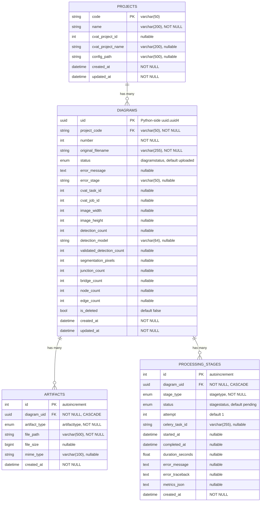

# DB_SCHEMA.md — Схема базы данных

**Аудитория:** DEV
**Версия:** 1.2
**Обновлено:** 2026-07-30
**Связанные документы:** [ARCHITECTURE.md](ARCHITECTURE.md), [STATUS_MACHINE.md](STATUS_MACHINE.md), [API.md](API.md)

---

## Содержание

1. [Обзор](#1-обзор)
2. [ER-диаграмма](#2-er-диаграмма)
3. [Таблица projects](#3-таблица-projects)
4. [Таблица diagrams](#4-таблица-diagrams)
5. [Таблица artifacts](#5-таблица-artifacts)
6. [Таблица processing_stages](#6-таблица-processing_stages)
7. [Enum-типы](#7-enum-типы)
8. [Подключение и сессии](#8-подключение-и-сессии)
9. [Миграции (Alembic)](#9-миграции-alembic)
10. [Чеклист: как добавить новый тип артефакта](#10-чеклист-как-добавить-новый-тип-артефакта)

---

## 1. Обзор

БД — PostgreSQL 15, ORM — SQLAlchemy 2.x (Mapped columns), миграции — Alembic. Базовый класс моделей: `app/db/base.py` → `Base(DeclarativeBase)` с naming convention для constraints.

Четыре таблицы: `projects`, `diagrams`, `artifacts`, `processing_stages`. Связи: project (1) → diagrams (N), diagram (1) → artifacts (N), diagram (1) → processing_stages (N).

---

## 2. ER-диаграмма



---

## 3. Таблица projects

**Модель:** `app/models/project.py` → `Project`

Каждый проект представляет домен (термогидравлика, электрика) со своим набором классов оборудования, YOLO-моделью и CVAT-проектом. Конфигурация — в YAML (`configs/projects/{code}/{code}.yaml`), динамические данные — в БД.

| Колонка | Тип | Constraints | Описание |
|---------|-----|------------|----------|
| `code` | `VARCHAR(50)` | PK | Уникальный код: `thermohydraulics`, `tec_boiler` |
| `name` | `VARCHAR(200)` | NOT NULL | Человекочитаемое имя |
| `cvat_project_id` | `INTEGER` | nullable | ID проекта в CVAT (создаётся при первом экспорте) |
| `cvat_project_name` | `VARCHAR(200)` | nullable | Имя проекта в CVAT |
| `config_path` | `VARCHAR(500)` | nullable | Относительный путь к YAML-конфигу (формат: `configs/projects/{code}/{code}.yaml`, например `configs/projects/thermohydraulics/thermohydraulics.yaml`) |
| `created_at` | `TIMESTAMP` | NOT NULL, default `now()` | Время создания |
| `updated_at` | `TIMESTAMP` | NOT NULL, default `now()` | Время последнего обновления |

**Relationships:** `diagrams` → `Diagram` (one-to-many, back_populates `project`).

---

## 4. Таблица diagrams

**Модель:** `app/models/diagram.py` → `Diagram`

Центральная сущность pipeline. Каждая диаграмма — один сканированный лист P&ID.

| Колонка | Тип | Constraints | Описание |
|---------|-----|------------|----------|
| `uid` | `UUID` | PK, default `uuid.uuid4` (Python-side) | Уникальный идентификатор. UUID генерируется на стороне Python (ORM), не PostgreSQL. При вставке через raw SQL необходимо указывать uid явно |
| `project_code` | `VARCHAR(50)` | FK → `projects.code`, NOT NULL, INDEX | Код проекта |
| `number` | `INTEGER` | NOT NULL | Порядковый номер в проекте |
| `original_filename` | `VARCHAR(255)` | NOT NULL | Имя загруженного файла |
| `status` | `diagramstatus` | NOT NULL, default `uploaded`, INDEX | Текущий статус обработки |
| `error_message` | `TEXT` | nullable | Текст ошибки (при status=error) |
| `error_stage` | `VARCHAR(50)` | nullable | Этап ошибки (для retry в UI) |
| `cvat_task_id` | `INTEGER` | nullable | ID задачи в CVAT |
| `cvat_job_id` | `INTEGER` | nullable | ID job в CVAT |
| `image_width` | `INTEGER` | nullable | Ширина изображения (px) |
| `image_height` | `INTEGER` | nullable | Высота изображения (px) |
| `detection_count` | `INTEGER` | nullable | Количество детекций (YOLO) |
| `detection_model` | `VARCHAR(64)` | nullable | Использованная модель |
| `validated_detection_count` | `INTEGER` | nullable | Количество после валидации CVAT |
| `segmentation_pixels` | `INTEGER` | nullable | Количество пикселей сегментации |
| `junction_count` | `INTEGER` | nullable | Количество перекрёстков |
| `bridge_count` | `INTEGER` | nullable | Количество мостов |
| `node_count` | `INTEGER` | nullable | Количество узлов в графе |
| `edge_count` | `INTEGER` | nullable | Количество рёбер в графе |
| `is_deleted` | `BOOLEAN` | NOT NULL, default `false` | Soft delete |
| `created_at` | `TIMESTAMP` | NOT NULL, default `now()` | Время создания |
| `updated_at` | `TIMESTAMP` | NOT NULL, default `now()`, onupdate | Время последнего обновления |

**Constraints:**
- `uq_diagram_project_number` — UNIQUE(`project_code`, `number`): в рамках проекта номера уникальны.
- `ix_diagrams_status` — INDEX на `status` для фильтрации по этапу.

**Relationships:** `project` → `Project`, `artifacts` → `Artifact` (cascade `all, delete-orphan`), `stages` → `ProcessingStage` (cascade `all, delete-orphan`).

---

## 5. Таблица artifacts

**Модель:** `app/models/artifact.py` → `Artifact`

Каждая запись — один файл, созданный на определённом этапе pipeline. У одной диаграммы может быть только один артефакт каждого типа (UNIQUE constraint).

| Колонка | Тип | Constraints | Описание |
|---------|-----|------------|----------|
| `id` | `INTEGER` | PK, autoincrement | — |
| `diagram_uid` | `UUID` | FK → `diagrams.uid` (CASCADE), NOT NULL, INDEX | — |
| `artifact_type` | `artifacttype` | NOT NULL, INDEX | Тип артефакта |
| `file_path` | `VARCHAR(500)` | NOT NULL | Относительный путь от `STORAGE_PATH` |
| `file_size` | `BIGINT` | nullable | Размер файла (байт) |
| `mime_type` | `VARCHAR(100)` | nullable | MIME-тип (`image/png`, `application/json`) |
| `created_at` | `TIMESTAMP` | NOT NULL, default `now()` | Время создания |

**Constraints:**
- `uq_artifact_diagram_type` — UNIQUE(`diagram_uid`, `artifact_type`): один артефакт каждого типа на диаграмму. **Важно:** constraint определён в Alembic-миграции (`0001_initial_full_schema`), но **отсутствует** в `__table_args__` ORM-модели. При создании тестовой БД через `Base.metadata.create_all()` (а не через Alembic) constraint не будет создан.
- FK с `ondelete='CASCADE'`: при удалении диаграммы — каскадное удаление артефактов.

**Helper-методы:**
- `Artifact.training_types()` — возвращает set типов артефактов, используемых для дообучения моделей: `YOLO_VALIDATED`, `COCO_VALIDATED`, `PIPE_MASK_VALIDATED`, `JUNCTION_MASK_VALIDATED`, `BRIDGE_MASK_VALIDATED`, `GRAPH_VALIDATED`.

**Worker utility:** `upsert_artifact()` (`worker/utils/db_helpers.py`) — создаёт или обновляет артефакт; безопасен при retry (не создаёт дубли).

---

## 6. Таблица processing_stages

**Модель:** `app/models/stage.py` → `ProcessingStage`

История выполнения этапов — каждый запуск worker task создаёт запись. При retry — новая запись с `attempt + 1`.

| Колонка | Тип | Constraints | Описание |
|---------|-----|------------|----------|
| `id` | `INTEGER` | PK, autoincrement | — |
| `diagram_uid` | `UUID` | FK → `diagrams.uid` (CASCADE), NOT NULL, INDEX | — |
| `stage_type` | `stagetype` | NOT NULL, INDEX | Тип этапа |
| `status` | `stagestatus` | NOT NULL, default `pending` | Статус этапа |
| `attempt` | `INTEGER` | default `1` | Номер попытки |
| `celery_task_id` | `VARCHAR(255)` | nullable | ID Celery task |
| `started_at` | `TIMESTAMP` | nullable | Время начала |
| `completed_at` | `TIMESTAMP` | nullable | Время завершения |
| `duration_seconds` | `FLOAT` | nullable | Длительность (сек) |
| `error_message` | `TEXT` | nullable | Сообщение об ошибке |
| `error_traceback` | `TEXT` | nullable | Traceback (усечённый до 10000 символов) |
| `metrics_json` | `TEXT` | nullable | JSON с метриками этапа |
| `created_at` | `TIMESTAMP` | NOT NULL, default `now()` | Время создания записи |

**Instance-методы:** `start()` → устанавливает `RUNNING` и `started_at`; `complete(metrics)` → `COMPLETED`, вычисляет `duration_seconds`, сохраняет metrics как JSON; `fail(error, traceback)` → `FAILED`.

**Worker helpers:** `start_stage(db, uid, stage_type, celery_task_id)` — создаёт запись, вызывает `start()`, делает `flush()`. `complete_stage(stage, metrics)` и `fail_stage(stage, error, tb)` — обёртки.

---

## 7. Enum-типы

Все enums реализованы как `(str, enum.Enum)` в Python и как PostgreSQL `ENUM` в БД. Значения — lowercase строки.

### DiagramStatus

Определён в `app/models/diagram.py`. 28 значений + `error`. Полное описание — см. [STATUS_MACHINE.md §1](STATUS_MACHINE.md#1-все-значения-diagramstatus).

### ArtifactType

Определён в `app/models/artifact.py`. 33 значения. Полное описание — см. [ARCHITECTURE.md §6](ARCHITECTURE.md#6-артефакты-pipeline).

### StageType

Определён в `app/models/stage.py`:

| Значение | Описание |
|---------|----------|
| `upload` | Загрузка изображения |
| `detection` | YOLO + SAHI |
| `cvat_validation` | Валидация в CVAT |
| `segmentation` | UNet++ ensemble |
| `skeletonization` | Скелетизация (первичная) |
| `junction_classification` | CenterNet junction/bridge |
| `mask_validation` | Валидация масок (UI) |
| `final_skeletonization` | Финальная скелетизация |
| `graph_building` | Построение графа |
| `graph_validation` | Валидация графа (UI) |
| `contour_extraction` | SAM2 контуры |
| `ocr` | Surya + PaddleOCR |
| `layout` | Авто-раскладка графа на холсте перед «Ручной правкой» |
| `fxml_generation` | Генерация FXML |

### StageStatus

Определён в `app/models/stage.py`:

| Значение | Описание |
|---------|----------|
| `pending` | Создан, ожидает запуска |
| `running` | Выполняется |
| `completed` | Успешно завершён |
| `failed` | Ошибка |
| `skipped` | Пропущен |

---

## 8. Подключение и сессии

Файл `app/db/session.py` создаёт два движка:

### Синхронный (для Celery workers)

```python
engine = create_engine(DATABASE_URL, pool_pre_ping=True, pool_size=5, max_overflow=10)
SessionLocal = sessionmaker(bind=engine)
```

Worker tasks используют `SessionLocal()` напрямую — каждый task открывает и закрывает сессию самостоятельно.

### Асинхронный (для FastAPI)

```python
async_engine = create_async_engine(
    DATABASE_URL.replace("postgresql://", "postgresql+asyncpg://"),
    pool_pre_ping=True, pool_size=5, max_overflow=10,
)
AsyncSessionLocal = async_sessionmaker(
    async_engine, class_=AsyncSession, expire_on_commit=False,
)
```

Параметр `expire_on_commit=False` критичен для FastAPI: без него обращение к атрибутам ORM-объекта после `commit()` вызовет ошибку (SQLAlchemy попытается lazy load в sync-режиме).

API endpoints получают сессию через `Depends(get_async_db)`.

**Naming convention** для constraints (для автоматического именования Alembic):

```python
convention = {
    "ix": "ix_%(column_0_label)s",
    "uq": "uq_%(table_name)s_%(column_0_name)s",
    "ck": "ck_%(table_name)s_%(constraint_name)s",
    "fk": "fk_%(table_name)s_%(column_0_name)s_%(referred_table_name)s",
    "pk": "pk_%(table_name)s",
}
```

---

## 9. Миграции (Alembic)

Конфигурация: `alembic.ini` + `alembic/env.py`. Текущая цепочка миграций:

| Revision | Описание |
|---------|----------|
| `0001_full_schema` | Начальная схема: все таблицы и enums (squashed из 7 миграций) |
| `a1b2c3d4e5f7` | Добавление `pipe_mask_refined` в `artifacttype` |
| `0003_add_ocr_stagetype` | Добавление `ocr` в `stagetype` |
| `0004_add_contour_pipeline` | Добавление contour статусов, артефактов и stage type |
| `0005_add_frame_removal` | Этап удаления рамки |
| `0006_add_direction_stagetype` | Добавление `direction` в `stagetype` |
| `0007_add_error_code_failed_step` | `error_code` и `failed_step` у диаграммы |
| `0008_add_current_step` | `current_step` у диаграммы |
| `0009_add_graph_canvas` | Добавление `graph_canvas` в `artifacttype` |
| `0010_add_junction_points` | Добавление `junction_points`, `junction_points_validated` в `artifacttype` |
| `0011_add_layout_stagetype` | Добавление `layout` в `stagetype` (стадия авто-раскладки) |
| `0012_add_residual_defects` | Добавление `residual_defects` в `artifacttype`; накатывать раньше кода воркера (как `0010`) |

**Порядок деплоя для `0010`:** миграция накатывается **раньше** кода воркера —
иначе insert нового значения enum уронит этап junction для всех диаграмм.
Значение enum в PostgreSQL неудаляемо, `downgrade` — no-op.

### Особенность PostgreSQL: ALTER TYPE ADD VALUE

PostgreSQL не позволяет `ALTER TYPE ... ADD VALUE` внутри транзакции. Все миграции, добавляющие значения в enum, содержат `COMMIT` перед `ALTER TYPE`:

```python
def upgrade():
    op.execute(text("COMMIT"))
    op.execute(text("ALTER TYPE artifacttype ADD VALUE IF NOT EXISTS 'new_value'"))
```

`IF NOT EXISTS` делает миграцию идемпотентной. `downgrade()` — no-op, т.к. PostgreSQL не поддерживает удаление значений из enum.

### Как запустить миграции

```bash
# Из контейнера api или локально:
alembic upgrade head
```

---

## 10. Чеклист: как добавить новый тип артефакта

1. **Enum:** Добавить значение в `ArtifactType` (`app/models/artifact.py`).
2. **Миграция:** Создать Alembic migration:
   ```python
   def upgrade():
       op.execute("COMMIT")
       op.execute("ALTER TYPE artifacttype ADD VALUE IF NOT EXISTS 'my_new_type'")
   ```
3. **Storage:** Определить папку и имя файла в `StorageService` или в task.
4. **Rollback:** Добавить тип в `_STAGE_ARTIFACTS` соответствующего этапа в `app/api/rollback.py`.
5. **Worker:** В task использовать `upsert_artifact()` для записи в БД.
6. **API:** Если нужен download — добавить endpoint в соответствующий router.
7. **Тест:** Проверить, что rollback удаляет новый артефакт.

---

## Новые термины для GLOSSARY.md

| Термин | Описание |
|--------|----------|
| **upsert_artifact** | Функция в `worker/utils/db_helpers.py` — создаёт или обновляет запись Artifact, безопасна при retry |
| **naming convention** | Соглашение об именовании constraints в SQLAlchemy MetaData, используется Alembic для автоименования |
| **squashed migration** | Начальная миграция `0001_full_schema`, объединяющая 7 ранних миграций в одну |
