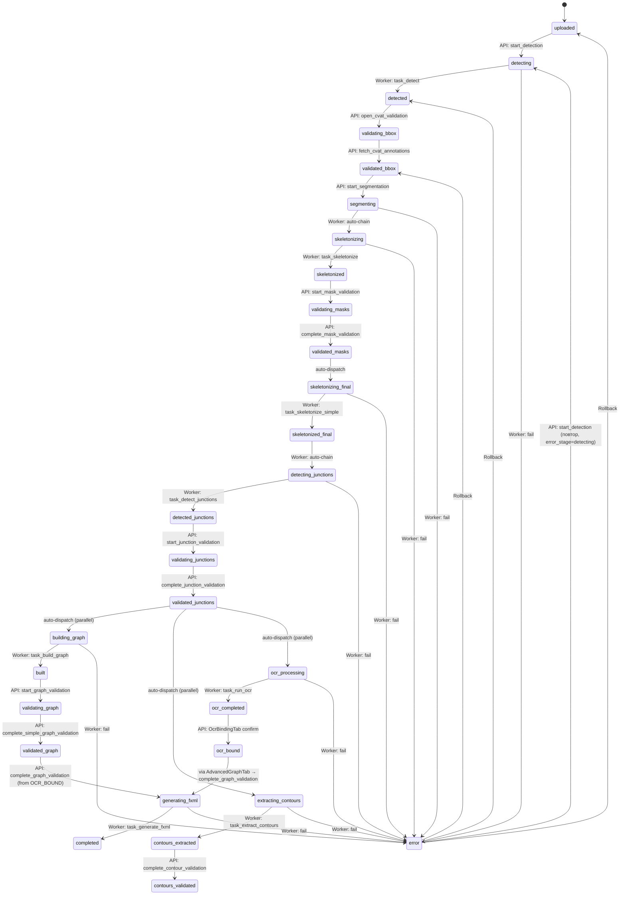

# STATUS_MACHINE.md — Машина состояний DiagramStatus

**Аудитория:** DEV
**Версия:** 1.1
**Обновлено:** 2026-04-09
**Связанные документы:** [ARCHITECTURE.md](ARCHITECTURE.md), [DB_SCHEMA.md](DB_SCHEMA.md), [API.md](API.md), [WORKER_TASKS.md](WORKER_TASKS.md)

---

## Содержание

1. [Все значения DiagramStatus](#1-все-значения-diagramstatus)
2. [Диаграмма переходов](#2-диаграмма-переходов)
3. [Кто меняет статус](#3-кто-меняет-статус)
4. [Rollback system](#4-rollback-system)
5. [Error handling](#5-error-handling)
6. [Idempotency](#6-idempotency)

---

## 1. Все значения DiagramStatus

Enum `DiagramStatus` определён в `app/models/diagram.py`. Все значения — lowercase строки (`str, enum.Enum`), совпадающие с PostgreSQL enum `diagramstatus`.

| # | Значение | Фаза | Описание |
|---|---------|------|----------|
| 0 | `uploaded` | Upload | Изображение загружено, обработка не начата |
| 1 | `detecting` | Detection | YOLO + SAHI запущен (worker) |
| 2 | `detected` | Detection | Детекция завершена, готово к валидации в CVAT |
| 3 | `validating_bbox` | Detection | Оператор работает в CVAT |
| 4 | `validated_bbox` | Detection | Аннотации из CVAT получены |
| 5 | `segmenting` | Segmentation | UNet++ ensemble запущен (worker) |
| 6 | `skeletonizing` | Skeleton #1 | Скелетизация запущена (авто-chain после segmentation) |
| 7 | `skeletonized` | Skeleton #1 | Начальный скелет готов, маски доступны для валидации |
| 8 | `validating_masks` | Mask validation | Оператор редактирует pipe mask в UI |
| 9 | `validated_masks` | Mask validation | Pipe mask подтверждена |
| 10 | `skeletonizing_final` | Skeleton #2 | Финальная скелетизация на validated маске (worker) |
| 11 | `skeletonized_final` | Skeleton #2 | Финальный скелет готов |
| 12 | `detecting_junctions` | Junction | CenterNet запущен (worker, авто-chain после skeleton #2) |
| 13 | `detected_junctions` | Junction | Перекрёстки/мосты найдены, готово к валидации |
| 14 | `validating_junctions` | Junction | Оператор редактирует junction/bridge маски в UI |
| 15 | `validated_junctions` | Junction | Маски подтверждены → запуск Graph + SAM2 + OCR (параллельно) |
| 16 | `building_graph` | Graph | GraphBuilder запущен (worker) |
| 17 | `built` | Graph | Граф построен, готов к валидации |
| 18 | `validating_graph` | Graph | Оператор редактирует граф в SimpleGraphTab |
| 19 | `validated_graph` | Graph | Граф подтверждён |
| 20 | `extracting_contours` | Contours | SAM2 + LoRA запущен (worker, параллельно с graph) |
| 21 | `contours_extracted` | Contours | SAM2 контуры готовы |
| 22 | `contours_validated` | Contours | Контуры подтверждены оператором |
| 23 | `ocr_processing` | OCR | Surya + PaddleOCR запущен (worker, параллельно с graph) |
| 24 | `ocr_completed` | OCR | Текст распознан |
| 25 | `ocr_bound` | OCR | Текст привязан к узлам/рёбрам оператором |
| 26 | `generating_fxml` | FXML | Генерация FXML запущена (worker) |
| 27 | `completed` | FXML | Pipeline завершён, FXML готов |
| — | `error` | Error | Ошибка на любом этапе |

---

## 2. Диаграмма переходов



**Примечание:** Три ветки после `validated_junctions` (graph, contours, OCR) запускаются параллельно. `DiagramStatus` отражает **основную ветку** (graph). OCR и SAM2 отслеживаются по наличию артефактов — см. [ARCHITECTURE.md §7](ARCHITECTURE.md#7-параллелизм).

---

## 3. Кто меняет статус

Статус диаграммы меняется из трёх источников: API endpoint (FastAPI), Worker task (Celery) и UI (через API).

| Переход | Источник | Код |
|---------|---------|-----|
| `frame_cleaned → detecting` | API | `app/api/detection.py`: `start_detection()` |
| `error → detecting` | API | `app/api/detection.py`: `start_detection()` при `error_stage == "detecting"` |
| `detecting → detected` | Worker | `worker/tasks/detection.py`: `task_detect()` |
| `detected → validating_bbox` | API | `app/api/cvat.py`: `open_cvat_validation()` |
| `validating_bbox → validated_bbox` | API | `app/api/cvat.py`: `fetch_cvat_annotations()` |
| `validated_bbox → segmenting` | API | `app/api/segmentation.py`: `start_segmentation()` |
| `segmenting → skeletonizing` | Worker | `worker/tasks/segmentation.py`: auto-chain |
| `skeletonizing → skeletonized` | Worker | `worker/tasks/skeleton.py`: `task_skeletonize()` |
| `skeletonized → validating_masks` | API | `app/api/validation.py`: `start_mask_validation()` |
| `validating_masks → validated_masks` | API | `app/api/validation.py`: `complete_mask_validation()` |
| `validated_masks → skeletonizing_final` | API | auto-dispatch из `complete_mask_validation()` |
| `skeletonizing_final → skeletonized_final` | Worker | `worker/tasks/skeleton.py`: `task_skeletonize_simple()` |
| `skeletonized_final → detecting_junctions` | Worker | auto-chain из `task_skeletonize_simple()` |
| `detecting_junctions → detected_junctions` | Worker | `worker/tasks/junction.py`: `task_detect_junctions()` |
| `detected_junctions → validating_junctions` | API | `app/api/validation.py`: `start_junction_validation()` |
| `validating_junctions → validated_junctions` | API | `app/api/validation.py`: `complete_junction_validation()` |
| `validated_junctions → building_graph` | API | auto-dispatch из `complete_junction_validation()` |
| `validated_junctions → extracting_contours` | API | auto-dispatch (параллельно), queue `sam2` |
| `validated_junctions → ocr_processing` | API | auto-dispatch (параллельно), queue `ocr` |
| `building_graph → built` | Worker | `worker/tasks/graph.py`: `task_build_graph()` |
| `built → validating_graph` | API | `app/api/validation.py`: `start_graph_validation()` |
| `validating_graph → validated_graph` | API | `app/api/validation.py`: `complete_simple_graph_validation()` |
| `extracting_contours → contours_extracted` | Worker | `worker/tasks/contours.py`: `task_extract_contours()` |
| `contours_extracted → contours_validated` | API | `app/api/contours.py`: `complete_contour_validation()` |
| `ocr_processing → ocr_completed` | Worker | `worker/tasks/ocr.py`: `task_run_ocr()` |
| `ocr_completed → ocr_bound` | API | OcrBindingTab → API confirm |
| `* → generating_fxml` | API | `app/api/validation.py`: `complete_graph_validation()` |
| `generating_fxml → completed` | Worker | `worker/tasks/graph.py`: `task_generate_fxml()` |
| `* → error` | Worker | `worker/utils/db_helpers.py`: `set_diagram_error()` |

---

## 4. Rollback system

Rollback реализован в `app/api/rollback.py`. Endpoint: `POST /api/diagrams/{uid}/rollback?target_status=...`.

### Порядок этапов (_STAGE_ORDER)

Массив `_STAGE_ORDER` определяет линейный порядок «стабильных» статусов — точек, до которых можно откатиться. Промежуточные статусы (`*_ing`) отсутствуют — откат идёт до завершённого этапа.

```python
_STAGE_ORDER = [
    UPLOADED,
    DETECTED,
    VALIDATED_BBOX,
    SKELETONIZED,
    VALIDATED_MASKS,
    SKELETONIZED_FINAL,
    DETECTED_JUNCTIONS,
    VALIDATED_JUNCTIONS,
    BUILT,
    VALIDATED_GRAPH,
    CONTOURS_EXTRACTED,
    CONTOURS_VALIDATED,
    OCR_COMPLETED,
    OCR_BOUND,
    COMPLETED,
]
```

### Артефакты по этапам (_STAGE_ARTIFACTS)

Каждый этап владеет набором артефактов. При откате удаляются все артефакты этапов **после** target:

| Этап | Артефакты |
|------|----------|
| `DETECTED` | `YOLO_PREDICTED`, `COCO_PREDICTED`, `DETECTION_OVERLAY` |
| `VALIDATED_BBOX` | `YOLO_VALIDATED`, `COCO_VALIDATED` |
| `SKELETONIZED` | `NODE_MASK`, `PIPE_MASK`, `SEGMENTATION_OVERLAY`, `SKELETON`, `SKELETON_MASK` |
| `VALIDATED_MASKS` | `PIPE_MASK_VALIDATED` |
| `SKELETONIZED_FINAL` | `SKELETON_FINAL`, `PIPE_MASK_REFINED` |
| `DETECTED_JUNCTIONS` | `JUNCTION_MASK`, `BRIDGE_MASK` |
| `VALIDATED_JUNCTIONS` | `JUNCTION_MASK_VALIDATED`, `BRIDGE_MASK_VALIDATED` |
| `BUILT` | `GRAPH_JSON`, `GRAPH_OVERLAY` |
| `VALIDATED_GRAPH` | `GRAPH_VALIDATED` |
| `CONTOURS_EXTRACTED` | `CONTOURS_AUTO` |
| `CONTOURS_VALIDATED` | `CONTOURS_VALIDATED` |
| `OCR_COMPLETED` | `OCR_CLEANED`, `OCR_RESULT`, `OCR_BINDING` |
| `OCR_BOUND` | `OCR_VALIDATION` |
| `COMPLETED` | `FXML` |

### Preserve-флаги

При откате graph/contour этапов OCR и SAM2 могут быть сохранены (они запускались параллельно и не зависят от графа):

| Параметр | Описание | Когда используется |
|----------|----------|-------------------|
| `preserve_ocr` | Не удалять `OCR_CLEANED`, `OCR_RESULT`, `OCR_BINDING`, `OCR_VALIDATION` | Откат graph, val_graph, contours |
| `preserve_contours` | Не удалять `CONTOURS_AUTO`, `CONTOURS_VALIDATED` | Откат graph, val_graph, contours |

UI автоматически выставляет оба флага при откате кнопок «Граф», «Вал. графа», «Контуры» — см. `DiagramWorkspace._on_button_click()`.

### Логика отката

1. Валидация: `target_status` должен быть в `_STAGE_ORDER` и быть **раньше** текущего статуса.
2. Сбор типов артефактов: `_artifacts_to_delete(target, preserve_ocr, preserve_contours)`.
3. `DELETE FROM artifacts WHERE diagram_uid = ? AND artifact_type IN (?)`.
4. Установка `diagram.status = target`, очистка `error_message` и `error_stage`.

**Примечание:** физические файлы на диске НЕ удаляются — только записи в БД. При повторном запуске этапа файлы перезаписываются.

---

## 5. Error handling

### Установка ошибки (Worker)

Все worker tasks используют `set_diagram_error()` из `worker/utils/db_helpers.py`:

```python
set_diagram_error(db, diagram_uid, message, stage)
# → diagram.status = ERROR
# → diagram.error_message = message[:500]
# → diagram.error_stage = stage
```

`error_stage` — строковый идентификатор этапа (`"detecting"`, `"segmenting"`, `"building_graph"` и т.д.), используется UI для определения кнопки retry.

### Отображение в UI

`DiagramWorkspace._update_buttons()` маппит `error_stage` на ключ кнопки:

| `error_stage` | Кнопка (key) |
|---------------|-------------|
| `detecting` | `detect` |
| `segmenting` | `segment` |
| `skeletonizing` | `segment` |
| `skeletonizing_simple` | `pipe` |
| `detecting_junctions` | `junction` |
| `building_graph` | `graph` |
| `validating_graph` | `val_graph` |
| `contour_extraction` | `contours` |
| `generating_fxml` | `fxml` |
| `ocr` | `ocr` |

Кнопка с ошибкой отображается красной с иконкой 🔄 (retry). Клик → окно отчёта об ошибке → повторный запуск ТОГО ЖЕ этапа его штатным эндпоинтом запуска. Отката при этом не происходит: клиент зовёт `POST /api/detection/{uid}/detect`, `/api/segmentation/{uid}/segment` и т.д., а не retry-эндпоинты — те из UI не вызываются вовсе. Поэтому гейт статуса у эндпоинта запуска обязан пропускать `error` со своим `error_stage`, иначе оператор попадает в тупик (пункт 1.11 дороги).

### ProcessingStage

Каждый запуск task записывает `ProcessingStage` в БД (см. [DB_SCHEMA.md](DB_SCHEMA.md)): `start_stage()` → `complete_stage()` / `fail_stage()`. Содержит: время начала/конца, длительность, номер попытки, celery_task_id, error_message, error_traceback, metrics_json.

---

## 6. Idempotency

Все API endpoints и worker tasks содержат проверки идемпотентности — корректно обрабатывают повторный вызов если pipeline уже ушёл вперёд.

### В API endpoints

Endpoints `complete_*` принимают не только «ожидаемый» статус, но и последующие. Пример из `complete_mask_validation()`:

```python
if diagram.status not in (
    DiagramStatus.VALIDATING_MASKS,
    DiagramStatus.SKELETONIZED,        # ещё не переключился
    DiagramStatus.VALIDATED_MASKS,     # уже переключился
    DiagramStatus.SKELETONIZING_FINAL, # chain уже запустился
    DiagramStatus.SKELETONIZED_FINAL,
    DiagramStatus.DETECTING_JUNCTIONS,
    DiagramStatus.DETECTED_JUNCTIONS,
    DiagramStatus.BUILT,
    DiagramStatus.VALIDATED_GRAPH,
    DiagramStatus.OCR_COMPLETED,
):
    raise HTTPException(400, ...)
```

Если chain уже ушёл вперёд — endpoint возвращает успех без изменения статуса и без повторного dispatch (`already_past` проверка).

**Примечание:** Каждый `complete_*` endpoint имеет свой набор допустимых статусов. Например, `complete_junction_validation()` помимо прямых статусов включает `VALIDATED_JUNCTIONS`, `BUILDING_GRAPH`, `BUILT`, `VALIDATED_GRAPH`, `CONTOURS_EXTRACTED`, `CONTOURS_VALIDATED`, `OCR_COMPLETED`. Полные списки — в исходном коде `app/api/validation.py`.

### В Worker tasks

Каждый task проверяет: если диаграмма удалена (`check_deleted()`), или текущий статус уже дальше ожидаемого — task завершается без ошибки (skip).

### Auto-approve при отсутствии валидации

Если оператор не загрузил валидированную маску, `complete_*` endpoint копирует оригинальную маску как validated (auto-approve). Это позволяет пропускать валидацию:

- `complete_mask_validation()`: копирует `pipe_mask.png` → `pipe_mask_validated.png`
- `complete_junction_validation()`: копирует `junction_mask.png` → `junction_mask_validated.png`, `bridge_mask.png` → `bridge_mask_validated.png`
- `complete_simple_graph_validation()`: копирует `graph.json` → `graph_validated.json`

---

## Новые термины для GLOSSARY.md

| Термин | Описание |
|--------|----------|
| **_STAGE_ORDER** | Массив стабильных статусов в линейном порядке для определения допустимых откатов (`app/api/rollback.py`) |
| **_STAGE_ARTIFACTS** | Словарь: статус → список типов артефактов, создаваемых на этом этапе |
| **auto-approve** | Копирование оригинального артефакта как validated при завершении валидации без явной загрузки |
| **error_stage** | Строковый идентификатор этапа, на котором произошла ошибка; используется UI для отображения кнопки retry |
