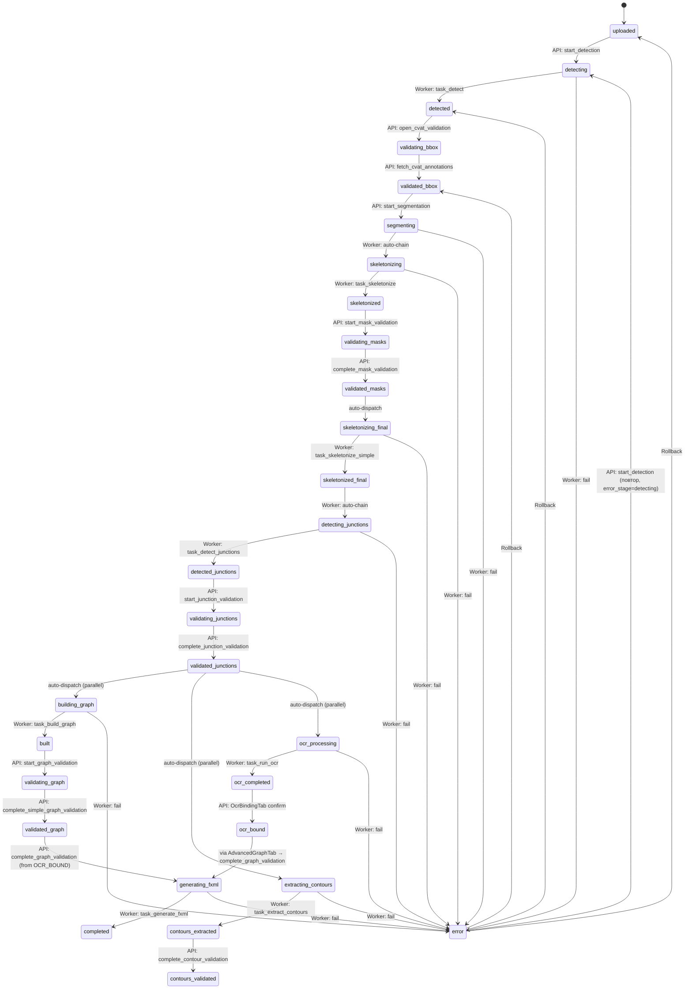

# STATUS_MACHINE.md — Машина состояний DiagramStatus

**Аудитория:** DEV
**Версия:** 1.1
**Обновлено:** 2026-04-09
**Связанные документы:** [ARCHITECTURE.md](ARCHITECTURE.md), [DB_SCHEMA.md](DB_SCHEMA.md), [API.md](API.md), [WORKER_TASKS.md](WORKER_TASKS.md)

---

## Содержание

1. [Все значения DiagramStatus](#1-все-значения-diagramstatus)
2. [Диаграмма переходов](#2-диаграмма-переходов)
3. [Кто меняет статус](#3-кто-меняет-статус)
4. [Rollback system](#4-rollback-system)
5. [Error handling](#5-error-handling)
6. [Idempotency](#6-idempotency)

---

## 1. Все значения DiagramStatus

Enum `DiagramStatus` определён в `app/models/diagram.py`. Все значения — lowercase строки (`str, enum.Enum`), совпадающие с PostgreSQL enum `diagramstatus`.

| # | Значение | Фаза | Описание |
|---|---------|------|----------|
| 0 | `uploaded` | Upload | Изображение загружено, обработка не начата |
| 1 | `detecting` | Detection | YOLO + SAHI запущен (worker) |
| 2 | `detected` | Detection | Детекция завершена, готово к валидации в CVAT |
| 3 | `validating_bbox` | Detection | Оператор работает в CVAT |
| 4 | `validated_bbox` | Detection | Аннотации из CVAT получены |
| 5 | `segmenting` | Segmentation | UNet++ ensemble запущен (worker) |
| 6 | `skeletonizing` | Skeleton #1 | Скелетизация запущена (авто-chain после segmentation) |
| 7 | `skeletonized` | Skeleton #1 | Начальный скелет готов, маски доступны для валидации |
| 8 | `validating_masks` | Mask validation | Оператор редактирует pipe mask в UI |
| 9 | `validated_masks` | Mask validation | Pipe mask подтверждена |
| 10 | `skeletonizing_final` | Skeleton #2 | Финальная скелетизация на validated маске (worker) |
| 11 | `skeletonized_final` | Skeleton #2 | Финальный скелет готов |
| 12 | `detecting_junctions` | Junction | CenterNet запущен (worker, авто-chain после skeleton #2) |
| 13 | `detected_junctions` | Junction | Перекрёстки/мосты найдены, готово к валидации |
| 14 | `validating_junctions` | Junction | Оператор редактирует junction/bridge маски в UI |
| 15 | `validated_junctions` | Junction | Маски подтверждены → запуск Graph + SAM2 + OCR (параллельно) |
| 16 | `building_graph` | Graph | GraphBuilder запущен (worker) |
| 17 | `built` | Graph | Граф построен, готов к валидации |
| 18 | `validating_graph` | Graph | Оператор редактирует граф в SimpleGraphTab |
| 19 | `validated_graph` | Graph | Граф подтверждён |
| 20 | `extracting_contours` | Contours | SAM2 + LoRA запущен (worker, параллельно с graph) |
| 21 | `contours_extracted` | Contours | SAM2 контуры готовы |
| 22 | `contours_validated` | Contours | Контуры подтверждены оператором |
| 23 | `ocr_processing` | OCR | Surya + PaddleOCR запущен (worker, параллельно с graph) |
| 24 | `ocr_completed` | OCR | Текст распознан |
| 25 | `ocr_bound` | OCR | Текст привязан к узлам/рёбрам оператором |
| 26 | `generating_fxml` | FXML | Генерация FXML запущена (worker) |
| 27 | `completed` | FXML | Pipeline завершён, FXML готов |
| — | `error` | Error | Ошибка на любом этапе |

---

## 2. Диаграмма переходов



**Примечание:** Три ветки после `validated_junctions` (graph, contours, OCR) запускаются параллельно. `DiagramStatus` отражает **основную ветку** (graph). OCR и SAM2 отслеживаются по наличию артефактов — см. [ARCHITECTURE.md §7](ARCHITECTURE.md#7-параллелизм).

---

## 3. Кто меняет статус

Статус диаграммы меняется из трёх источников: API endpoint (FastAPI), Worker task (Celery) и UI (через API).

| Переход | Источник | Код |
|---------|---------|-----|
| `frame_cleaned → detecting` | API | `app/api/detection.py`: `start_detection()` |
| `error → detecting` | API | `app/api/detection.py`: `start_detection()` при `error_stage == "detecting"` |
| `detecting → detected` | Worker | `worker/tasks/detection.py`: `task_detect()` |
| `detected → validating_bbox` | API | `app/api/cvat.py`: `open_cvat_validation()` |
| `validating_bbox → validated_bbox` | API | `app/api/cvat.py`: `fetch_cvat_annotations()` |
| `validated_bbox → segmenting` | API | `app/api/segmentation.py`: `start_segmentation()` |
| `error → segmenting` | API | `app/api/segmentation.py`: `start_segmentation()` — по `error_stage` выбирает шаг перезапуска; `direction_classification` и `segmenting` заводят цепочку `task_classify_direction → task_segment_pipes` заново |
| `segmenting → skeletonizing` | Worker | `worker/tasks/segmentation.py`: auto-chain |
| `skeletonizing → skeletonized` | Worker | `worker/tasks/skeleton.py`: `task_skeletonize()` |
| `skeletonized → validating_masks` | API | `app/api/validation.py`: `start_mask_validation()` |
| `validating_masks → validated_masks` | API | `app/api/validation.py`: `complete_mask_validation()` |
| `validated_masks → skeletonizing_final` | API | auto-dispatch из `complete_mask_validation()` |
| `skeletonizing_final → skeletonized_final` | Worker | `worker/tasks/skeleton.py`: `task_skeletonize_simple()` |
| `skeletonized_final → detecting_junctions` | Worker | auto-chain из `task_skeletonize_simple()` |
| `detecting_junctions → detected_junctions` | Worker | `worker/tasks/junction.py`: `task_detect_junctions()` |
| `detected_junctions → validating_junctions` | API | `app/api/validation.py`: `start_junction_validation()` |
| `validating_junctions → validated_junctions` | API | `app/api/validation.py`: `complete_junction_validation()` |
| `validated_junctions → building_graph` | API | auto-dispatch из `complete_junction_validation()` |
| `validated_junctions \| built \| error → building_graph` | API | `app/api/graph.py`: `start_graph_building()` — ручной запуск и оба повтора |
| `validated_junctions → extracting_contours` | API | auto-dispatch (параллельно), queue `sam2` |
| `validated_junctions → ocr_processing` | API | auto-dispatch (параллельно), queue `ocr` |
| `building_graph → built` | Worker | `worker/tasks/graph.py`: `task_build_graph()` |
| `built → validating_graph` | API | `app/api/validation.py`: `start_graph_validation()` |
| `validating_graph → validated_graph` | API | `app/api/validation.py`: `complete_simple_graph_validation()` |
| `extracting_contours → contours_extracted` | Worker | `worker/tasks/contours.py`: `task_extract_contours()` |
| `contours_extracted → contours_validated` | API | `app/api/contours.py`: `complete_contour_validation()` |
| `ocr_processing → ocr_completed` | Worker | `worker/tasks/ocr.py`: `task_run_ocr()` |
| `ocr_completed → ocr_bound` | API | OcrBindingTab → API confirm |
| `* → generating_fxml` | API | `app/api/validation.py`: `complete_graph_validation()` |
| `generating_fxml → completed` | Worker | `worker/tasks/graph.py`: `task_generate_fxml()` |
| `* → error` | Worker | `worker/utils/db_helpers.py`: `set_diagram_error()` |

**Отказ отправки — не переход.** API-эндпоинт коммитит статус этапа ДО `send_task`, поэтому
упавшая отправка обязана вернуть состояние, каким оно было до вызова: статус и оба поля
ошибки (`error_message`, `error_stage`). Это не откат из §4 — этапа не было, откатывать
нечего. Точка возврата обязана лежать внутри `Precondition` самого эндпоинта, иначе повтор
отвечает 400 навсегда: так и было в `start_graph_building()` до пункта 1.14 дороги — откат
ставил `validated_masks`, которого нет в его же списке допустимых статусов.

---

## 4. Rollback system

Rollback реализован в `app/api/rollback.py`. Endpoint: `POST /api/diagrams/{uid}/rollback?target_status=...`.

### Порядок этапов (_STAGE_ORDER)

Массив `_STAGE_ORDER` определяет линейный порядок «стабильных» статусов — точек, до которых можно откатиться. Промежуточные статусы (`*_ing`) отсутствуют — откат идёт до завершённого этапа.

```python
_STAGE_ORDER = [
    UPLOADED,
    DETECTED,
    VALIDATED_BBOX,
    SKELETONIZED,
    VALIDATED_MASKS,
    SKELETONIZED_FINAL,
    DETECTED_JUNCTIONS,
    VALIDATED_JUNCTIONS,
    BUILT,
    VALIDATED_GRAPH,
    CONTOURS_EXTRACTED,
    CONTOURS_VALIDATED,
    OCR_COMPLETED,
    OCR_BOUND,
    COMPLETED,
]
```

### Артефакты по этапам (_STAGE_ARTIFACTS)

Каждый этап владеет набором артефактов. При откате удаляются все артефакты этапов **после** target:

| Этап | Артефакты |
|------|----------|
| `DETECTED` | `YOLO_PREDICTED`, `COCO_PREDICTED`, `DETECTION_OVERLAY` |
| `VALIDATED_BBOX` | `YOLO_VALIDATED`, `COCO_VALIDATED` |
| `SKELETONIZED` | `NODE_MASK`, `PIPE_MASK`, `SEGMENTATION_OVERLAY`, `SKELETON`, `SKELETON_MASK` |
| `VALIDATED_MASKS` | `PIPE_MASK_VALIDATED` |
| `SKELETONIZED_FINAL` | `SKELETON_FINAL`, `PIPE_MASK_REFINED` |
| `DETECTED_JUNCTIONS` | `JUNCTION_MASK`, `BRIDGE_MASK` |
| `VALIDATED_JUNCTIONS` | `JUNCTION_MASK_VALIDATED`, `BRIDGE_MASK_VALIDATED` |
| `BUILT` | `GRAPH_JSON`, `GRAPH_OVERLAY` |
| `VALIDATED_GRAPH` | `GRAPH_VALIDATED` |
| `CONTOURS_EXTRACTED` | `CONTOURS_AUTO` |
| `CONTOURS_VALIDATED` | `CONTOURS_VALIDATED` |
| `OCR_COMPLETED` | `OCR_CLEANED`, `OCR_RESULT`, `OCR_BINDING` |
| `OCR_BOUND` | `OCR_VALIDATION` |
| `COMPLETED` | `FXML` |

### Preserve-флаги

При откате graph/contour этапов OCR и SAM2 могут быть сохранены (они запускались параллельно и не зависят от графа):

| Параметр | Описание | Когда используется |
|----------|----------|-------------------|
| `preserve_ocr` | Не удалять `OCR_CLEANED`, `OCR_RESULT`, `OCR_BINDING`, `OCR_VALIDATION` | Откат graph, val_graph, contours |
| `preserve_contours` | Не удалять `CONTOURS_AUTO`, `CONTOURS_VALIDATED` | Откат graph, val_graph, contours |

UI автоматически выставляет оба флага при откате кнопок «Граф», «Вал. графа», «Контуры» — см. `DiagramWorkspace._on_button_click()`.

### Логика отката

1. Валидация: `target_status` должен быть в `_STAGE_ORDER` и быть **раньше** текущего статуса.
2. Сбор типов артефактов: `_artifacts_to_delete(target, preserve_ocr, preserve_contours)`.
3. `DELETE FROM artifacts WHERE diagram_uid = ? AND artifact_type IN (?)`.
4. Установка `diagram.status = target`, очистка `error_message` и `error_stage`.

**Примечание:** физические файлы на диске НЕ удаляются — только записи в БД. При повторном запуске этапа файлы перезаписываются.

---

## 5. Error handling

### Установка ошибки (Worker)

Все worker tasks используют `set_diagram_error()` из `worker/utils/db_helpers.py`:

```python
set_diagram_error(db, diagram_uid, message, stage)
# → diagram.status = ERROR
# → diagram.error_message = message[:500]
# → diagram.error_stage = stage
```

`error_stage` — строковый идентификатор этапа (`"detecting"`, `"segmenting"`, `"building_graph"` и т.д.), используется UI для определения кнопки retry.

### Отображение в UI

`DiagramWorkspace._update_buttons()` маппит `error_stage` на ключ кнопки:

| `error_stage` | Кнопка (key) |
|---------------|-------------|
| `detecting` | `detect` |
| `direction_classification` | `segment` |
| `segmenting` | `segment` |
| `skeletonizing` | `segment` |
| `skeletonizing_simple` | `pipe` |
| `detecting_junctions` | `junction` |
| `building_graph` | `graph` |
| `validating_graph` | `val_graph` |
| `contour_extraction` | `contours` |
| `generating_fxml` | `fxml` |
| `ocr` | `ocr` |

Эта таблица — **фолбэк**: она работает, когда `/stages` недоступен. Штатно клиент идёт другим путём — `_apply_error_status()` берёт из `/stages` последнюю попытку каждой стадии и маппит **`stage_type`** на ту же кнопку картой `_STAGE_TYPE_TO_KEY` (`direction_classification`, `segmentation`, `skeletonization` и `final_skeletonization` → `segment`; `layout` → `edit_graph`; единственный `StageType` без кнопки — `upload`). Обе карты обязаны знать один и тот же набор стадий: стадия, которой нет ни в одной, не показывается оператору вовсе — ни красной бусиной, ни окном отчёта (пункт 1.12 дороги: так молчала классификация направления).

Кнопка с ошибкой отображается красной с иконкой 🔄 (retry). Клик → окно отчёта об ошибке → повторный запуск ТОГО ЖЕ этапа его штатным эндпоинтом запуска. Отката при этом не происходит: клиент зовёт `POST /api/detection/{uid}/detect`, `/api/segmentation/{uid}/segment` и т.д., а не retry-эндпоинты. Поэтому гейт статуса у эндпоинта запуска обязан пропускать `error` со своим `error_stage`, иначе оператор попадает в тупик (пункт 1.11 дороги).

Из трёх retry-эндпоинтов (`detection.py:132`, `cvat.py:503`, `diagrams.py:427`) клиент зовёт **один** — и только когда нажать больше нечего (см. ниже). Прежняя редакция этого раздела говорила «те из UI не вызываются вовсе»: это было верно до пункта 1-36 (`6d170ec`), которым появилась страховка.

### Выход из тупика: `POST /api/diagrams/{uid}/retry`

Ветка включается по УСЛОВИЮ «ни одна из 13 кнопок не доступна», а не по списку значений (`_offer_error_retry`, пункт 1-36). Такое бывает, когда `/stages` недоступен, а в памяти клиента лежит ещё не протухшая **бегущая** строка той самой стадии: она держит кнопку в `processing` и гасит её раньше, чем фолбэк успевает покрасить в красный. Клиент в этой ветке не гадает — куда откатывать, решает сервер своей картой `error_stage → предыдущий статус` (`app/api/diagrams.py:449`):

| `error_stage` | статус после retry | | `error_stage` | статус после retry |
|---|---|---|---|---|
| `detecting` | `frame_cleaned` | | `skeletonizing_simple` | `validated_masks` |
| `creating_cvat_task` | `detected` | | `skeletonizing_final` | `validated_masks` |
| `fetching_annotations` | `validating_bbox` | | `detecting_junctions` | `skeletonized_final` |
| `direction_classification` | `validated_bbox` | | `building_graph` | `validated_junctions` |
| `segmenting` | `validated_bbox` | | `contour_extraction` | `validated_graph` |
| `skeletonizing` | `segmenting` | | `ocr` | `validated_graph` |
| `validating_masks` | `skeletonized` | | `generating_fxml` | `ocr_bound` |

Артефакты при этом НЕ удаляются — эндпоинт трогает только статус и снимает `error_message`/`error_stage` (откат с удалением артефактов — это `POST /api/diagrams/{uid}/rollback`, §4).

⚠ **Дефолт этой карты — `UPLOADED`, то есть самое начало конвейера**, где оператору доступна ровно одна кнопка «Очистка рамки»: детекцию, CVAT-валидацию и валидацию масок пришлось бы пройти заново. Сегодня в дефолт падают только `error_stage = None` и значения, которых не пишет никто (динамический писатель `safe_dispatch` кладёт имя задачи — `worker/utils/db_helpers.py:146`, вызывающих в боевом коде у него нет). Все **11** значений, которые пишутся, картой покрыты — до пункта 1.15 дороги четыре из них (`direction_classification`, `ocr`, `contour_extraction`, `generating_fxml`) уходили в это самое начало. Перебор по полному множеству (31 статус × 13 значений) держит `tests/test_retry_target_table.py`, достижимость тупика и сам выход — `tests/ui/test_retry_exit_target.py`.

Цели отката совпадают с клиентской картой `DiagramWorkspace._ROLLBACK_TARGET` («статус ПЕРЕД этим этапом») у всех значений, кроме четырёх исторических расхождений (`skeletonizing`, `skeletonizing_simple`, `detecting_junctions`, `fetching_annotations`) — они зафиксированы тестом как есть и сводятся вместе с реестром стадий (волна 5 дороги).

⚠ **У OCR своей кнопки в целевом статусе нет, и дверь там другая.** Кнопка «OCR» появляется только с `ocr_completed`, а после отката это была бы неправда — OCR не завершался. Переотправляет его `POST /api/validation/{uid}/graph/complete-simple` (кнопка «Проверка схемы», `val_graph`): `validated_graph` его гейт пускает, ветки «ушли вперёд» у него нет, значит задача уходит заново. Подтверждение валидации перекрёстков дверью **не является** — его гейт `validated_graph` не пускает вовсе и отвечает 400 (замер ревизии связки, §104.10; пересняно §107.1). До доработки ноги 1.15 дверью в комментарии карты и в докстроке теста значилось именно оно.

⛔ **Граница, названная и НЕ починенная: у двух значений из четырёх дверь целевого статуса глушит та же бегущая строка, что создала тупик.** Клик по страховке меняет статус на сервере, но `_last_stages` в памяти клиента остаётся прежним (`_on_error_retry` зовёт только `_refresh_status`), а `_update_buttons` переводит кнопку бегущей стадии в `processing` независимо от статуса — до `WAIT_LIMIT_S` = 600 с. Замерено исполнением в том же воркспейсе (§107.2):

| `error_stage` | статус после retry | дверь | кликабельно сразу после клика |
|---|---|---|---|
| `direction_classification` | `validated_bbox` | `segment` — **глухая** | `cvat`, `detect`, `frame` — только откаты с удалением артефактов |
| `contour_extraction` | `validated_graph` | `contours` — **глухая** | всё остальное, включая `val_graph` |
| `ocr` | `validated_graph` | `val_graph` — жива | — |
| `generating_fxml` | `ocr_bound` | `edit_graph` — жива | — |

То есть выход есть у всех четырёх, но у двух он на 600 с дороже: либо ждать, пока строка протухнет (`_stage_stuck`), либо откатываться дальше назад с удалением артефактов. Что гасит именно строка, а не статус, показано разницей: следующий опрос стадий, закрывший строку, отдаёт дверь обратно. Механизм (`_update_buttons`) СТАРШЕ ноги и лечится в клиенте — чисткой стадий, которые сервер только что объявил недействительными; здесь он зафиксирован как есть тестом `test_the_running_row_survives_the_rollback_and_mutes_its_own_door`, который покраснеет, когда его починят.

### Отказ отправки задачи (503)

Эндпоинты запуска этапов коммитят статус ДО `send_task` — короткой транзакцией, потому что
брать брокер внутрь транзакции БД нельзя. Брокер лёг между двумя действиями — отправка падает,
и диаграмма осталась бы в `*ING`-статусе, которого никто не снимет: задачи нет, значит некому
ни упасть в `error`, ни дойти до конца. Кнопка своей стадии при `*ING`-статусе не нажимается,
поправка `_MANUAL_INPROGRESS` знает только четыре ручных `VALIDATING_*` — выхода без правки БД
не было.

**Чем и через сколько падает `send_task` — перемерено четырьмя точками, и виноват не брокер**
(MEASUREMENTS §87д, сводка §91):

| что мертво | исключение | через сколько |
|---|---|---|
| **брокер И result-бэкенд — это и есть бой**: оба сидят на одном Redis | `builtins.RuntimeError` («Retry limit exceeded while trying to reconnect to the Celery **result store backend**») | **≈ 64 с** |
| только брокер, бэкенд жив | `kombu.exceptions.OperationalError` | ≈ 4 с |

64 секунды набирает retry-цикл **result-бэкенда**: он отрабатывает внутри `send_task` ДО
публикации в брокер. Это НЕ «боевые настройки повторов брокера» — `broker_connection_max_retries`,
`broker_connection_timeout` и `task_publish_retry_policy` в `worker/celery_app.py` не заданы вовсе
(греп пуст), у всех приложений они дефолтные Celery. Понадобится резать окно — резать у бэкенда
(`result_backend_transport_options`), крутить `broker_connection_*` бесполезно.

Отсюда форма защиты: ловится `Exception`, а не узкий класс. Узкий `except OperationalError`
промахнулся бы мимо боевого `RuntimeError` и оставил бы тупик ровно там, где его чинят;
`except (OperationalError, OSError)` — тоже, и вот к нему остальная таблица слепа: инъекция
такого сужения красит РОВНО один тест из всей решётки — параметр `dead-result-backend`
в `test_real_broker_exception_class_is_not_special` (замер §91.5).

⚠ **Названный здесь 503 оператор не увидит НИКОГДА.** Клиент ждёт ответа 60 с
(`ui/services/api_client.py`, `timeout=60.0`), сервер отвечает на 64-й: оператор получает
ошибку клиентского таймаута, а клиент ещё и повторяет POST (`max_retries=3`). На сам тупик это
не влияет — состояние на сервере возвращается в любом случае: разрыв соединения обработчик не
отменяет (замер §87з; единственный middleware приложения — CORS, а отменять запрос умел бы
`BaseHTTPMiddleware`, которого в `app/main.py` нет). Но читать это надо так: у оператора
«зависло на минуту», а в логе — `dispatch_failed`.

Поэтому **отказ отправки — не переход**: он возвращает состояние, каким оно было ДО вызова,
и отвечает 503. Возвращаются все три поля, которые записал переход, а не один статус: вход
`error` иначе вернулся бы с пустым `error_stage`, а на этом сочетании клиент гасит ВСЕ кнопки
(`_error_key → None`). Точка возврата заведомо лежит внутри `Precondition` самого эндпоинта,
поэтому повтор после подъёма брокера проходит.

| эндпоинт | статус после отказа |
|----------|---------------------|
| `POST /api/detection/{uid}/detect` | тот же, что был до вызова |
| `POST /api/detection/{uid}/retry` | тот же |
| `POST /api/segmentation/{uid}/segment` | тот же |
| `POST /api/skeleton/{uid}/skeletonize` | тот же |
| `POST /api/junction/{uid}/detect-junctions` | тот же |
| `POST /api/validation/{uid}/masks/complete` | тот же |
| `POST /api/validation/{uid}/junctions/complete` | тот же (по отказу сборки графа; про OCR — ниже) |
| `POST /api/validation/{uid}/graph/complete-simple` | тот же |
| `POST /api/validation/{uid}/graph/complete` | тот же |
| `POST /api/graph/{uid}/build` | тот же |

Это не откат из §4 — этапа не было, откатывать нечего. Заперто двумя таблицами переходов:
`tests/test_stage_dispatch_failure_gate.py` (пять эндпоинтов запуска стадий) и
`tests/test_validation_dispatch_failure_gate.py` (четыре эндпоинта завершения валидации) —
каждая по 31 статусу × 11 значений `error_stage`, в двух ветках (брокер жив и брокер лёг).

⚠ **У эндпоинтов завершения валидации отказ выглядел ИНАЧЕ, и это была отдельная болезнь**
(нога 1.16, MEASUREMENTS §99). Они отправляют не напрямую, а через
`app/services/dispatch.async_safe_dispatch`, который исключение брокера ГЛОТАЕТ и возвращает
`None`. `None` не проверял никто, поэтому наружу уходило **200 с `task_id: null`** — тот же
ответ, каким отвечает идемпотентное «цепочка уже ушла вперёд». Отличить одно от другого
клиенту было нечем, и он печатал оператору «✅ … (цепочка уже запущена)»
(`ui/widgets/diagram_workspace.py`), а `graph/complete` он и вовсе сам красил
в `generating_fxml` и уходил в опрос. Два статуса при этом — тупики без единой доступной
кнопки: `validated_masks` и `generating_fxml` не лежат в `_MANUAL_INPROGRESS`, а бусины
своих этапов при них «в процессе». **Теперь `task_id: null` в ответе 200 означает ровно
одно — «ушли вперёд»**, а отказ отправки отвечает 503 и возвращает состояние.

**Ветка, где возврата НЕТ и это осознанная граница: параллельный OCR
в `junctions/complete`.** Задача сборки графа к этому моменту уже в брокере, и возврат
состояния осиротил бы её. Поэтому отказ OCR не откатывает ничего: он назван в ответе
(`"OCR NOT started (broker unavailable)"`, `ocr_task_id: null`) и оставляет след
`event=dispatch_failed`. Штатное восстановление даёт следующий шаг — тот же OCR из
`graph/complete-simple`, который [API.md §7](API.md) называет idempotent safety net.
Заперто `test_ocr_failure_alone_is_named_and_traced`.

**Ветка, где обещание выше не выполняется: БД легла ВМЕСТЕ с брокером** (на бою это один и тот
же отказ — одна машина, один рестарт). Коммит возврата тогда падает сам, состояние остаётся
`*ING`, оператор получает 500 глобального хендлера — то есть ровно тот тупик, что был до правки,
и не хуже. Единственное, что остаётся в этой ветке, — **след**: `logger.exception` с
`event=dispatch_failed` стоит ДО коммита возврата специально ради неё, иначе исключение БД
уносило бы наружу и его, и в логе не было бы сказано, что отказала ОТПРАВКА. Заперто
`test_dispatch_failed_trace_survives_a_dead_db` — и у эндпоинтов запуска стадий,
и у эндпоинтов завершения валидации (одноимённый тест в каждой из двух таблиц).

**Ветка, где обещание выполняется ВЕРОЯТНОСТНО: клиент повторяет POST раньше, чем сервер
успевает отказать.** Числа те же, что абзацем выше, и они не сходятся: клиент ждёт ответа
**60 с** и по таймауту повторяет запрос (`ui/services/api_client.py`, `_request` ловит
`httpx.RequestError`, а таймаут — его подкласс; `max_retries=3`), а боевой отказ `send_task`
наступает на **64-й**. Значит один клик оператора собирает на сервере до четырёх
КОНКУРЕНТНЫХ обработчиков одного и того же эндпоинта.

Возврат состояния сделан СНИМКОМ (`previous_state` читается в начале перехода и пишется
безусловно — last-writer-wins, долг A1), поэтому при конкуренции снимок бывает ЧУЖИМ:
обработчик №2 входит, пока №1 висит в отправке, запоминает как «состояние до вызова» уже
закоммиченный №1 целевой статус — и, кончая последним, записывает его. Замер (§107.5,
`masks/complete`, вход `validating_masks`):

| порядок завершения | статус в финале | кнопок у оператора |
|---|---|---|
| №2 последним (боевой: у него больше попыток) | `validated_masks` | **0 — исходный тупик пункта** |
| №1 последним | `validating_masks` | `pipe` — точка возврата цела |
| обработчик один (без конкурента) | `validating_masks` | `pipe` |

Лог в первой строке честен и абсурден одновременно: «возвращаю состояние в `validated_masks`».
⚠ Читать это надо так: **ни одна клетка не стала хуже** — до правки тупик был во всех четырёх
исходах из четырёх, теперь это лотерея чётности попыток, — но обещание «отказ отправки не
переход» на боевом профиле выполняется не всегда. Честная починка требует УСЛОВНОГО UPDATE
(«верни, только если статус всё ещё тот, что я записал»), то есть правки класса записи статуса
целиком — это отдельный пункт дороги (5-3), а не эта нога. Граница заперта тестами
`test_a_concurrent_handler_restores_a_stale_snapshot`,
`test_the_stale_snapshot_is_named_in_the_log` и порогом достижимости
`test_the_client_gives_up_before_the_server_does`: поднимут клиентский таймаут выше 64 с или
починят гонку — тесты скажут об этом вслух.

Наконец, **503 обязан быть виден оператору**. Три подтверждения валидации из четырёх
показывали окно отказа и раньше; `_check_masks_completion` — нет: он глотал исключение
с комментарием «chain may have already moved past this point», который был верен ровно до
этой ноги (пока отказ отвечал 200 с `task_id: null`). Теперь «ушли вперёд» — по-прежнему 200,
а 503 означает обратное, и клиент показывает такое же окно, как соседи (заперто
`test_a_refused_dispatch_is_shown_to_the_operator` и порогом «удачное подтверждение молчит»).

### ProcessingStage

Каждый запуск task записывает `ProcessingStage` в БД (см. [DB_SCHEMA.md](DB_SCHEMA.md)): `start_stage()` → `complete_stage()` / `fail_stage()`. Содержит: время начала/конца, длительность, номер попытки, celery_task_id, error_message, error_traceback, metrics_json.

---

## 6. Idempotency

Все API endpoints и worker tasks содержат проверки идемпотентности — корректно обрабатывают повторный вызов если pipeline уже ушёл вперёд.

### В API endpoints

Endpoints `complete_*` принимают не только «ожидаемый» статус, но и последующие. Пример из `complete_mask_validation()`:

```python
if diagram.status not in (
    DiagramStatus.VALIDATING_MASKS,
    DiagramStatus.SKELETONIZED,        # ещё не переключился
    DiagramStatus.VALIDATED_MASKS,     # уже переключился
    DiagramStatus.SKELETONIZING_FINAL, # chain уже запустился
    DiagramStatus.SKELETONIZED_FINAL,
    DiagramStatus.DETECTING_JUNCTIONS,
    DiagramStatus.DETECTED_JUNCTIONS,
    DiagramStatus.BUILT,
    DiagramStatus.VALIDATED_GRAPH,
    DiagramStatus.OCR_COMPLETED,
):
    raise HTTPException(400, ...)
```

Если chain уже ушёл вперёд — endpoint возвращает успех без изменения статуса и без повторного dispatch (`already_past` проверка).

**Примечание:** Каждый `complete_*` endpoint имеет свой набор допустимых статусов. Например, `complete_junction_validation()` помимо прямых статусов включает `VALIDATED_JUNCTIONS`, `BUILDING_GRAPH`, `BUILT`, `VALIDATED_GRAPH`, `CONTOURS_EXTRACTED`, `CONTOURS_VALIDATED`, `OCR_COMPLETED`. Полные списки — в исходном коде `app/api/validation.py`.

### В Worker tasks

Каждый task проверяет: если диаграмма удалена (`check_deleted()`), или текущий статус уже дальше ожидаемого — task завершается без ошибки (skip).

### Auto-approve при отсутствии валидации

Если оператор не загрузил валидированную маску, `complete_*` endpoint копирует оригинальную маску как validated (auto-approve). Это позволяет пропускать валидацию:

- `complete_mask_validation()`: копирует `pipe_mask.png` → `pipe_mask_validated.png`
- `complete_junction_validation()`: копирует `junction_mask.png` → `junction_mask_validated.png`, `bridge_mask.png` → `bridge_mask_validated.png`
- `complete_simple_graph_validation()`: копирует `graph.json` → `graph_validated.json`

---

## Новые термины для GLOSSARY.md

| Термин | Описание |
|--------|----------|
| **_STAGE_ORDER** | Массив стабильных статусов в линейном порядке для определения допустимых откатов (`app/api/rollback.py`) |
| **_STAGE_ARTIFACTS** | Словарь: статус → список типов артефактов, создаваемых на этом этапе |
| **auto-approve** | Копирование оригинального артефакта как validated при завершении валидации без явной загрузки |
| **error_stage** | Строковый идентификатор этапа, на котором произошла ошибка; используется UI для отображения кнопки retry |
